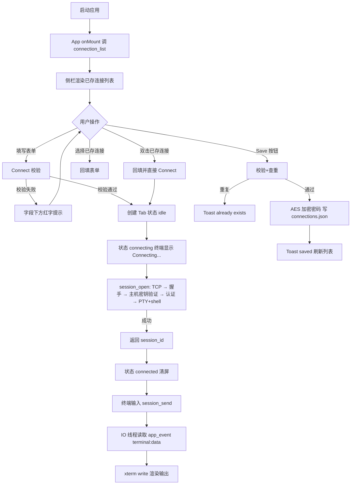
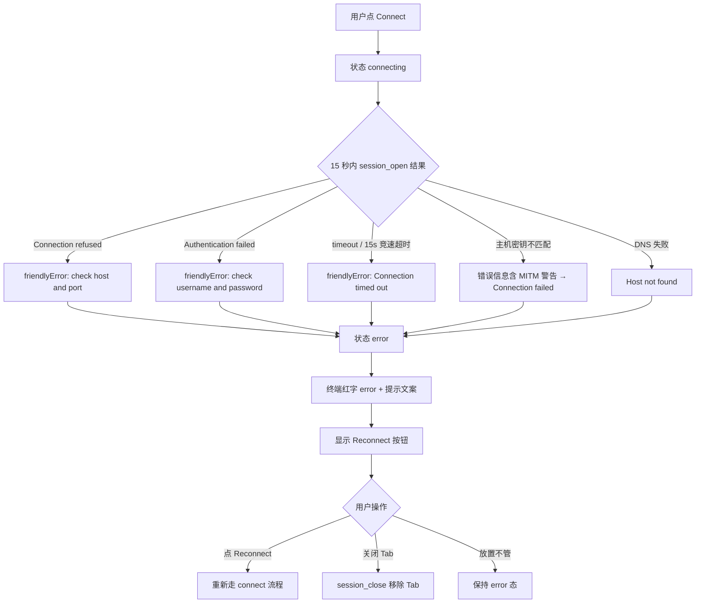
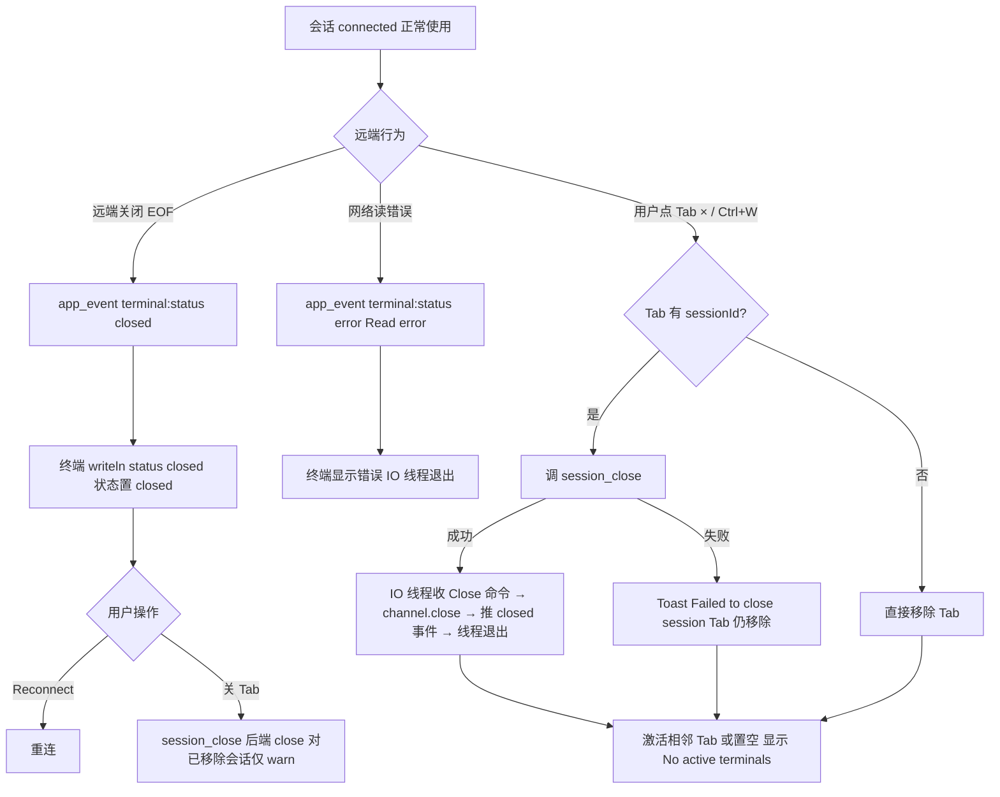
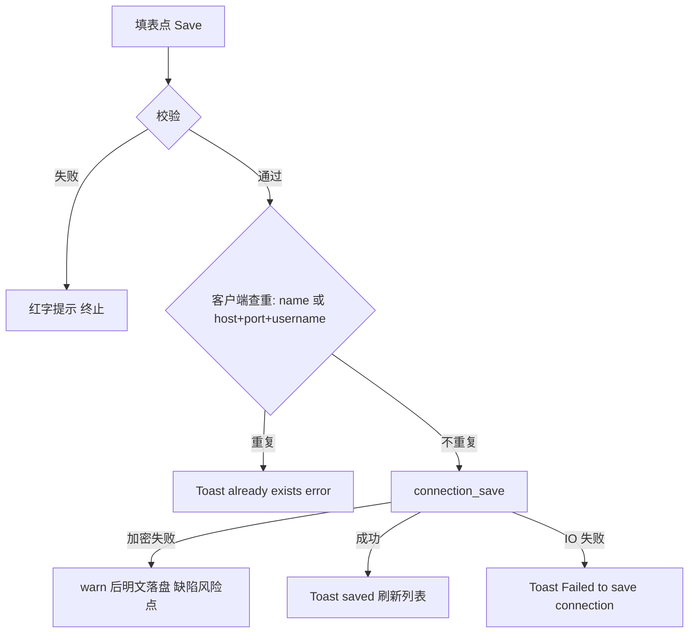

# TermForge 逆向分析报告

> 版本：v1.0（2026-09-02 生成）
> 分析对象：`/Users/luoyaosheng/Desktop/project/Open/TermForge`（本地仓库，git 最后改动时间 2026-04-21）
> 分析方法：逐文件阅读 `src-ui/`、`src-tauri/` 全部源码 + 项目内既有文档（README.md / CLAUDE.md / PROGRESS.md / 产品需求.md / 代码骨架.md / _bmad-output/*）交叉对照。
> 原则：功能清单以**代码实际为准**；规划文档仅作对照素材。凡代码中无法确认的内容标注【未知】。

---

## ① 项目概述

### 产品定位

TermForge（规划公开仓库名 `lys-term-forge`）是一个**跨平台 SSH / SFTP / Runbook 运维桌面工作台**（来源：README.md 第 3、7 行）。它不是单纯的 SSH 客户端，目标是把连接中心、SSH 终端、SFTP 文件管理、端口转发、Runbook 批量执行、本地安全存储整合为一个"工作台"形态的桌面工具（来源：README.md「产品目标」节、产品需求.md 第 11-19 行）。

**当前实现进度判断**（代码为准）：项目处于**早期实现阶段**——应用外壳（VS Code 风格布局）、连接中心、真实 SSH 终端主链路已可工作；SFTP / 隧道 / Runbook / 设置四个视图仅有空状态占位，无任何业务逻辑。

### 技术架构

| 层 | 技术 | 来源 |
|---|---|---|
| 前端框架 | Svelte 4 + TypeScript + Vite 5 | `src-ui/package.json` |
| 终端渲染 | xterm.js 5.3 + xterm-addon-fit 0.8 | `src-ui/package.json`、`TerminalTab.svelte` |
| 前后端桥接 | @tauri-apps/api 2.0（invoke 命令 + window 级 event 监听） | `src-ui/src/lib/api.ts` |
| 桌面壳 | Tauri 2（窗口 1200×800，min 800×500，CSP 白名单，标识 `com.termforge.app`） | `src-tauri/tauri.conf.json` |
| 后端 | Rust 2021 + Tokio（rt-multi-thread/sync/time）+ tauri-plugin-shell | `src-tauri/Cargo.toml`、`src-tauri/src/main.rs` |
| SSH 协议 | `ssh2` crate 0.9（libssh2 绑定） | `src-tauri/Cargo.toml`、`core/ssh/client.rs` |
| 加密 | aes-gcm（AES-256-GCM）+ sha2 + base64 + gethostname + whoami | `src-tauri/src/core/crypto.rs` |
| 日志 | tracing + tracing-subscriber（env-filter，默认 info） | `src-tauri/src/main.rs` |
| 其他 | nanoid（会话 ID）、dirs（home 目录）、serde/serde_json | `src-tauri/Cargo.toml` |
| 文档站 | VitePress（docs/，GitHub Pages 部署） | `docs/.vitepress/config.mjs`、`.github/workflows/deploy-docs.yml` |

**模块约定**（来源：`_bmad-output/planning-artifacts/epics.md` AR4，与代码实际一致）：
```
commands/（薄命令层，Tauri #[tauri::command]）
   → core/（业务逻辑：session_manager / ssh::client / crypto）
   → models/（DTO + 事件定义）
```

**事件流架构**：后端通过单一事件名 `app_event` 推送 `#[serde(tag = "type")]` 标签枚举到前端（来源：`models/events.rs`、`core/session_manager.rs` emit_status、`api.ts` onAppEvent）。前端用 `getCurrentWindow().listen()` 监听并按 `session_id` 过滤分发（来源：`TerminalTab.svelte` L122-134）。

### 用户类型

来源：产品需求.md 第 3 节「目标用户」。

1. 需要频繁 SSH 的开发者
2. 需要批量执行命令的运维人员
3. 独立开发者和小团队
4. 希望用桌面工具统一管理连接和操作记录的人

### 核心价值

1. 把"连上服务器干活"的完整动作（找连接 → 开终端 → 传文件 → 跑脚本）收进一个桌面工作台，而不是在多个工具间切换。
2. 连接配置本地加密持久化（AES-256-GCM，机器绑定密钥），避免明文密码落盘。
3. 多 Tab 并行会话 + 状态可视（idle/connecting/connected/closed/error 五态）。

---

## ② 项目结构分析

### 目录总览（不含 node_modules/.git/dist/target/二进制）

```
TermForge/
├── README.md / CLAUDE.md / PROGRESS.md / 产品需求.md / 代码骨架.md / LICENSE / .gitignore
├── .github/workflows/deploy-docs.yml        # 文档站部署
├── .claude/skills/                           # BMAD 方法论技能集（开发流程资产，非产品代码）
├── _bmad/                                    # BMAD 配置
├── _bmad-output/
│   ├── project-context.md
│   ├── planning-artifacts/                   # prd.md / architecture.md / epics.md / ux-design-specification.md / readiness-report
│   └── implementation-artifacts/             # sprint-status.yaml / deferred-work.md / story 设计文档 1-1~1-6
├── docs/                                     # VitePress 文档站（index.md + public/CNAME）
├── src-ui/                                   # 前端（Svelte 4）
│   ├── index.html / vite.config.ts / svelte.config.js / tsconfig*.json / package.json
│   └── src/
│       ├── main.ts                           # 应用入口，挂载 #app
│       ├── app.css                           # 设计令牌（Tokyo Night 色板）+ 全局 reset
│       ├── App.svelte                        # 应用外壳（Tab/快捷键/视图路由）
│       ├── lib/
│       │   ├── api.ts                        # Tauri invoke 封装 + AppEvent 类型 + 事件监听
│       │   ├── types.ts                      # TabStatus 类型
│       │   ├── toast.ts                      # Toast 通知 store（pub/sub）
│       │   └── icons.ts                      # 内联 SVG 图标（Lucide 风格，currentColor）
│       └── components/
│           ├── ConnectionForm.svelte         # 连接表单 + 已保存连接列表
│           ├── TerminalTab.svelte            # 单终端 Tab（xterm + 连接生命周期）
│           ├── layout/
│           │   ├── ActivityBar.svelte        # 最左侧视图导航条（5 个视图）
│           │   ├── SidePanel.svelte          # 侧栏（可折叠/拖宽，按视图切换内容）
│           │   ├── TabStrip.svelte           # 顶部终端 Tab 条
│           │   └── StatusBar.svelte          # 底部状态栏
│           └── primitives/
│               ├── CommandPalette.svelte     # 命令面板（占位实现）
│               ├── EmptyState.svelte         # 空状态通用组件
│               └── ToastContainer.svelte     # Toast 渲染容器
└── src-tauri/                                # 后端（Rust）
    ├── Cargo.toml / build.rs / tauri.conf.json / capabilities/default.json / icons/
    ├── gen/schemas/                          # Tauri 生成的 schema
    └── src/
        ├── main.rs                           # 入口：tracing 日志初始化 → termforge_lib::run()
        ├── lib.rs                            # Tauri Builder：注册 8 个命令 + 2 个 State
        ├── commands/
        │   ├── session.rs                    # session_open/send/close/list/resize
        │   └── store.rs                      # connection_list/save/delete + ConnectionStoreManager
        ├── core/
        │   ├── session_manager.rs            # 会话生命周期管理（HashMap<id, SessionHandle>）
        │   ├── crypto.rs                     # AES-256-GCM 加解密（含单元测试）
        │   └── ssh/client.rs                 # SSHSession：连接/认证/主机密钥验证/专用 IO 线程
        └── models/
            ├── dto.rs                        # 请求/响应 DTO（含密码脱敏 Debug）
            └── events.rs                     # AppEvent 枚举（terminal:data / terminal:status）
```

### 页面/视图目录（前端）

- `App.svelte` 是唯一路由者：无前端路由库，视图切换 = ActivityBar 点击改变 `activeView` 字符串（connections/sftp/tunnel/runbook/settings），SidePanel 按 `activeView` 渲染对应 slot/EmptyState（来源：`App.svelte` L254-264、`SidePanel.svelte` L146-156）。
- 主内容区 = TabStrip + 终端容器（`{#each tabs}` 渲染 TerminalTab，用 CSS display 控制激活态）+ StatusBar。

### 核心模块（后端）

| 模块 | 文件 | 职责 |
|---|---|---|
| 会话管理器 | `core/session_manager.rs` | `HashMap<String, SessionHandle>` 维护会话；open_ssh 用 `spawn_blocking` 包裹阻塞连接；send/resize 转发到 SSHSession；close 移除并关闭 |
| SSH 客户端 | `core/ssh/client.rs` | TCP connect → ssh2 handshake → 主机密钥验证（TOFU）→ 认证（密码/显式密钥/默认密钥探测）→ channel_session + request_pty("xterm-256color", 80×24) + shell → 启动专用 OS 线程做 5ms 轮询非阻塞读 + mpsc 命令处理（Write/Resize/Close） |
| 加密 | `core/crypto.rs` | 机器绑定密钥（hostname+username → SHA-256，固定盐 `TermForge-v1`）；encrypt= base64(nonce12B + ciphertext + tag16B)；含 2 个单元测试 |
| 连接存储 | `commands/store.rs` | `~/.termforge/connections.json`；list 时解密、save 时加密；Unix 下 0600 权限；save 按 id 更新或新增 |

### 公共组件（前端）

- `EmptyState`（icon/text/hint 三属性）、`ToastContainer` + `toast.ts` store（success/error/info 三类，3 秒自动淡出，可点击关闭）、`icons.ts`（connections/sftp/tunnel/runbook/settings/chevronLeft 六枚内联 SVG）。

### 服务层（前端）

- `lib/api.ts`：封装 8 个 Tauri 命令调用 + `onAppEvent` 事件订阅。注意：`AppEvent` 类型联合中包含 `sftp:progress`、`runbook:progress`、`monitor:snapshot` 三种事件——**后端 `events.rs` 只实现了 terminal:data 与 terminal:status 两种**，前三者是前端预留类型（规划残留）。

### Tauri 后端命令层（完整清单）

来源：`src-tauri/src/lib.rs` L16-27 invoke_handler 注册表。

| 命令 | 参数 | 返回 | 实现文件 |
|---|---|---|---|
| `session_open` | `req: SessionOpenRequest{host, port, username, password?, key_path?}` | `SessionOpenResponse{session_id}` | `commands/session.rs` |
| `session_send` | `req: {session_id, data}` | `()` | 同上 |
| `session_close` | `req: {session_id}` | `()` | 同上 |
| `session_list` | 无 | `Vec<SessionInfo>` | 同上 |
| `session_resize` | `session_id, cols: u16, rows: u16` | `()` | 同上 |
| `connection_list` | 无 | `Vec<SavedConnection>`（密码已解密） | `commands/store.rs` |
| `connection_save` | `conn: SavedConnection` | `()` | 同上 |
| `connection_delete` | `id: String` | `()` | 同上 |

Tauri capabilities（`capabilities/default.json`）：`core:default`、`core:event:allow-listen`、`core:event:allow-emit`、`core:window:allow-start-dragging`、`shell:allow-open`。

---

## ③ 页面清单表

以代码实际存在的"视图/浮层/状态页"为准（桌面单窗口应用，"页面"= 窗口内的视图与浮层）：

| 编号 | 页面 | 入口 | 文件 | 状态 |
|---|---|---|---|---|
| PAGE001 | 应用主工作台（外壳：活动栏+侧栏+Tab条+内容区+状态栏） | 应用启动 | `src-ui/src/App.svelte` | 已实现 |
| PAGE002 | 连接中心（侧栏 Connections 视图：已存连接列表 + 连接表单） | 活动栏"Connections"按钮 / Ctrl+T / Ctrl+Shift+N | `src-ui/src/components/ConnectionForm.svelte` + `SidePanel.svelte` | 已实现 |
| PAGE003 | 终端会话页（单 Tab：xterm 终端 + 状态 + 错误重连条） | 连接表单 Connect / 已存连接双击 | `src-ui/src/components/TerminalTab.svelte` | 已实现 |
| PAGE004 | SFTP 视图（空状态占位） | 活动栏"SFTP"按钮 | `SidePanel.svelte` L149（EmptyState） | 占位（未实现） |
| PAGE005 | 隧道视图（空状态占位） | 活动栏"Tunnel"按钮 | `SidePanel.svelte` L151（EmptyState） | 占位（未实现） |
| PAGE006 | Runbook 视图（空状态占位） | 活动栏"Runbook"按钮 | `SidePanel.svelte` L153（EmptyState） | 占位（未实现） |
| PAGE007 | 设置视图（空状态占位） | 活动栏"Settings"按钮 | `SidePanel.svelte` L155（EmptyState） | 占位（未实现） |
| PAGE008 | 命令面板（浮层，占位实现） | Ctrl+Shift+P | `src-ui/src/components/primitives/CommandPalette.svelte` | 占位（仅搜索框+提示，无命令列表） |
| PAGE009 | 终端区空态（无任何 Tab 时的主区引导页） | 关闭所有 Tab 后自动出现 | `App.svelte` L297-302（EmptyState） | 已实现 |
| PAGE010 | Toast 通知浮层（全局） | 保存/删除连接、关闭会话失败等操作触发 | `primitives/ToastContainer.svelte` + `lib/toast.ts` | 已实现 |

---

## ④ 页面详细分析

### PAGE001 应用主工作台

- **目的**：承载整个应用的 VS Code 风格布局，管理 Tab 与全局快捷键。
- **入口**：应用启动即进入（`main.ts` 挂载 App.svelte）。
- **元素**：
  - ActivityBar（48px 宽，5 个图标按钮：Connections/SFTP/Tunnel/Runbook/Settings，激活项左侧 3px 高亮条）——`ActivityBar.svelte`
  - SidePanel（默认 260px，可折叠至 0，可拖宽 180-400px，标题按视图变化，右上角折叠按钮）——`SidePanel.svelte`
  - TabStrip（36px 高，Tab 项含状态点+标题+关闭×，末尾 + 新建按钮）——`TabStrip.svelte`
  - 终端容器（占满剩余空间，无 Tab 时显示 EmptyState）——`App.svelte`
  - StatusBar（24px 高：左侧连接状态，右侧 UTF-8 + 字号菜单）——`StatusBar.svelte`
- **用户操作 → 系统响应**：
  - 点击活动栏图标 → 若与当前视图相同则切换折叠/展开，否则切换视图并展开（`App.svelte` handleViewChange L254-264）
  - 拖动侧栏右缘 → 实时调整宽度（min/max 从 CSS token 读取）
  - 全局快捷键（输入框/终端聚焦时部分失效，见下方"已知边界"）：
    - `Ctrl/Cmd+1..9`：切换到第 N 个 Tab（超出取最后一个）
    - `Ctrl/Cmd+T`：新连接（切到 connections 视图并展开侧栏）
    - `Ctrl/Cmd+W`：关闭当前 Tab
    - `Ctrl/Cmd+Tab` / `Ctrl/Cmd+Shift+Tab`：下一个/上一个 Tab（循环）
    - `Ctrl/Cmd+\`：切换侧栏折叠
    - `Ctrl/Cmd+Shift+P`：开关命令面板
    - `Ctrl/Cmd+Shift+N`：新连接并聚焦 Host 输入框
    - `Escape`：关闭命令面板（终端聚焦时不拦截）
- **状态变化**：`activeView`（5 值）、`sidePanelCollapsed`（bool）、`tabs[]`、`activeTabId`、`terminalFontSize`（6-32 限制）。
- **异常情况**：加载已存连接失败时静默（侧栏显示空列表）；关闭 Tab 时 `session_close` 失败 → Toast 错误提示，但 Tab 仍被移除（deferred-work.md 已记录此缺陷）。
- **数据来源**：`connection_list`（onMount 时）；键盘事件（window keydown）。
- **已知边界（代码事实）**：快捷键处理器在 `target instanceof HTMLInputElement/TextArea` 时直接 return，且 `Ctrl+Tab` 在多数浏览器/WebView 中是保留组合键（代码有 preventDefault，但实际生效情况【未知】）；`Ctrl+1..9`/`Ctrl+T`/`Ctrl+W` 在 Tauri WebView 内的系统性拦截效果【未知——未实测】。

### PAGE002 连接中心

- **目的**：填写/选择 SSH 连接参数，发起连接或保存为快捷连接。
- **入口**：活动栏 Connections 按钮；Ctrl+T；Ctrl+Shift+N（自动聚焦 Host）。
- **元素**（`ConnectionForm.svelte`）：
  - 已保存连接下拉框（`-- Select --` + 名称列表，仅有存档时渲染）
  - 已保存连接列表（名称 + hover 显示的 × 删除按钮；单击回填、双击直接连接；Enter 键回填；提示 "Double-click to connect"）
  - 表单字段：Host（文本，placeholder `e.g. 192.168.1.100`）、Port（数字，默认 "22"）、Username（文本，placeholder `e.g. admin`）、Password（password 型）
  - 按钮：Connect（主按钮）、Save（次按钮）
- **用户操作 → 系统响应**：
  - Connect：校验（Host 必填 / Port 1-65535 / Username 必填）→ 通过后派发 connect 事件 → App 创建新 Tab 并发起 SSH
  - Save：同样校验 → 客户端查重（name 相同 或 host+port+username 三元组相同 → Toast 报错 "already exists"）→ `connection_save` → Toast 成功 → 刷新列表
  - 删除：`confirm()` 原生对话框确认 → `connection_delete` → Toast 成功 → 若删除的是当前选中项则清空选择 → 刷新列表
  - 表单内按 Enter：触发 Connect（Shift/Ctrl+Enter 不触发）
  - 字段失焦（blur）后显示校验错误
- **状态变化**：`errors`/`touched` 控制错误提示显示；`submitting` 防重复提交（Save 期间两按钮 disabled）；`selectedConnId` 高亮列表项。
- **异常情况**：保存失败 Toast "Failed to save connection"；删除失败 Toast "Failed to delete connection"；加载列表失败静默。
- **数据来源**：`connection_list` / `connection_save` / `connection_delete`。
- **注意**：**没有"编辑连接"入口**——后端 save 支持按 id 更新，但前端没有编辑按钮（选择已有连接后点 Save 会因查重被拦）。也没有分组/标签/搜索/导入导出（产品需求.md 5.1 规划项，未实现）。

### PAGE003 终端会话页

- **目的**：承载单条 SSH 会话的 xterm 终端。
- **入口**：连接表单 Connect / 已存连接双击 → 创建 Tab。
- **元素**：xterm 容器（cursorBlink、scrollback 5000、主题色运行时读自 CSS token）；错误状态下的 Reconnect 按钮条。
- **生命周期**（`TerminalTab.svelte`）：
  1. onMount：动态 import xterm/FitAddon → 建 Terminal → open → fit → 绑定 onData（输入 → `session_send`）→ 监听 window resize → `connect()`
  2. `connect()`：订阅 app_event（按 session_id 过滤）→ 状态 connecting → 终端显示 "Connecting..." → `session_open`（15 秒 Promise.race 超时）→ 成功：清屏、状态 connected、派发 connected 事件（App 记录 sessionId）、发送初始 PTY 尺寸；失败：状态 error、终端红字 `[error] 友好消息` + 提示 "Press Ctrl+R or click Reconnect to retry."
  3. 事件到达：`terminal:data` → write(chunk)；`terminal:status` → writeln `[status] ...`，closed 时置状态 closed
  4. onDestroy：取消监听 + terminal.dispose()
- **用户操作 → 系统响应**：键盘输入 → `session_send`（catch 静默）；错误/关闭态点 Reconnect → 重新 connect。
- **状态变化**：五态 `idle → connecting → connected → closed / error`（`lib/types.ts` TabStatus）。TabStrip 状态点颜色映射：idle/closed=灰、connecting=黄(脉冲动画)、connected=绿(实心)、error=红(实心)。
- **异常情况**（friendlyError 映射表）：
  - "Connection refused" → "Connection refused — check host and port"
  - "Authentication" → "Authentication failed — check username and password"
  - "timed out/timeout" → "Connection timed out"
  - "Name or service not known" → "Host not found — check the address"
  - "Network is unreachable" → "Network unreachable"
  - 其他 → "Connection failed"
  - 注：错误提示文案写 `Ctrl+R` 重试，但**代码中没有注册 Ctrl+R 快捷键**——该提示是残留文案，实际只能点 Reconnect 按钮（明显 bug，如实记录）。
- **数据来源**：`session_open`/`session_send`/`session_resize` + app_event 流。
- **后端配合**（`core/ssh/client.rs`）：远端 EOF → 推送 `terminal:status closed "Connection closed by remote"`；读错误 → `error + Read error: ...`；写错误 → `error + Write error: ...`（不断连）；主机密钥不匹配 → 连接直接失败（错误信息含 MITM 警告）。

### PAGE004 SFTP 视图（占位）

- EmptyState：icon=sftp，text="No active SFTP session"，hint="Connect to a server first, then switch to SFTP view"。无任何业务代码、无后端命令。产品需求.md 5.3（列表/上传/下载/删除/重命名/新建目录/在线编辑）全部未实现。

### PAGE005 隧道视图（占位）

- EmptyState：text="No tunnels configured"，hint="Create a new tunnel to forward ports"。产品需求.md 5.4（Local Forward / SOCKS5）未实现。

### PAGE006 Runbook 视图（占位）

- EmptyState：text="No runbooks yet"，hint="Create a runbook to automate tasks"。产品需求.md 5.5（模板/参数化/批量执行/历史）未实现。

### PAGE007 设置视图（占位）

- EmptyState：text="Settings"，hint="Application settings will appear here"。产品需求.md 5.6 部分（危险命令确认规则等）未实现。当前唯一的"设置"能力是状态栏字号菜单（运行时，不持久化）。

### PAGE008 命令面板（占位）

- Ctrl+Shift+P 打开；居中 480px 面板 + 搜索输入框 + "Command Palette (placeholder)" 提示。Esc/点击背景关闭。**无任何可执行命令**（无命令列表、无搜索逻辑）。

### PAGE009 终端区空态

- 无 Tab 时主区显示：text="No active terminals"，hint="Use the sidebar to fill in SSH details and click Connect. Each connection opens a new tab."

### PAGE010 Toast 通知浮层

- 右下角（状态栏上方），栈式排列（新的在下）。三类：success(✓ 绿边)/error(✕ 红边)/info(ℹ 蓝边)。默认 3000ms 后淡出 250ms 移除；点击可立即关闭。`aria-live="polite"`。

---

## ⑤ 功能清单表

| ID | 功能 | 入口 | 实现位置 | 状态 |
|---|---|---|---|---|
| F001 | 活动栏视图切换（5 视图） | 活动栏按钮 | `ActivityBar.svelte` + `App.svelte` handleViewChange | 已实现 |
| F002 | 侧栏折叠/展开 | 折叠按钮 / Ctrl+\ / 再次点击活动栏当前视图 | `SidePanel.svelte` toggleCollapse + `App.svelte` L108-112 | 已实现 |
| F003 | 侧栏拖拽调宽（180-400px） | 拖动侧栏右缘 | `SidePanel.svelte` onDragStart（min/max 读自 CSS token） | 已实现 |
| F004 | 连接表单填写与失焦校验 | 连接中心表单 | `ConnectionForm.svelte` validate/blur | 已实现 |
| F005 | 发起 SSH 连接（创建 Tab） | Connect 按钮 / 表单 Enter | `ConnectionForm.svelte` handleConnect → `App.svelte` createTab | 已实现 |
| F006 | 保存连接（含客户端查重 + 加密落盘） | Save 按钮 | `ConnectionForm.svelte` handleSave → `commands/store.rs` save | 已实现 |
| F007 | 删除已存连接（confirm 确认） | 列表项 × 按钮 | `ConnectionForm.svelte` handleDelete → `connection_delete` | 已实现 |
| F008 | 选择已存连接回填表单 | 下拉选择 / 列表单击 / Enter | `ConnectionForm.svelte` selectConnection | 已实现 |
| F009 | 双击已存连接直接连接 | 列表项双击 | `ConnectionForm.svelte` handleDoubleClick | 已实现 |
| F010 | 新建 Tab（引导到连接中心） | Ctrl+T / TabStrip + 按钮 | `App.svelte` handleNewTab | 已实现 |
| F011 | 关闭 Tab（含后端会话清理） | Ctrl+W / Tab × 按钮 | `App.svelte` closeTab → `session_close` | 已实现 |
| F012 | Tab 切换（点击/Ctrl+1-9/Ctrl±Tab 循环） | Tab 点击 / 快捷键 | `App.svelte` handleKeydown + switchTab | 已实现 |
| F013 | Tab 双击重命名（Enter 确认/Esc 取消/blur 提交） | Tab 双击 | `TabStrip.svelte` startRename/finishRename | 已实现 |
| F014 | 终端建立连接（15s 超时） | Tab 创建后自动 | `TerminalTab.svelte` connect（Promise.race 15s） | 已实现 |
| F015 | 终端键盘输入发送 | 终端聚焦输入 | `TerminalTab.svelte` onData → `session_send` | 已实现 |
| F016 | 终端输出实时渲染（事件流） | 后端 app_event 推送 | `TerminalTab.svelte` 事件回调 write(chunk) | 已实现 |
| F017 | 终端 PTY 尺寸同步（fit+resize） | 窗口 resize / 字号变化 / 连接建立后 | `TerminalTab.svelte` doFit → `session_resize` | 已实现 |
| F018 | 终端字号调整（10-20px 档位） | 状态栏字号菜单 | `StatusBar.svelte` → `App.svelte` handleFontSizeChange（6-32 保护） | 已实现 |
| F019 | 连接错误友好提示（6 种映射） | 连接失败时 | `TerminalTab.svelte` friendlyError | 已实现 |
| F020 | 失败/断开后手动重连 | Reconnect 按钮 | `TerminalTab.svelte` reconnect | 已实现 |
| F021 | 状态栏连接状态展示（五态标签） | 自动 | `StatusBar.svelte` statusLabels | 已实现 |
| F022 | Toast 通知（3 类/自动消失/点击关闭） | 各操作触发 | `lib/toast.ts` + `ToastContainer.svelte` | 已实现 |
| F023 | 真实 SSH 连接（ssh2：TCP+握手+认证+PTY+shell） | session_open | `core/ssh/client.rs` SSHSession::new | 已实现 |
| F024 | 主机密钥验证（TOFU + 变更检测 MITM 告警） | 首次/后续连接 | `core/ssh/client.rs` verify_host_key（`~/.termforge/known_hosts`，SHA-256 指纹，0600） | 已实现 |
| F025 | 多认证方式（密码 / 显式 key_path / 默认 ~/.ssh 密钥探测） | session_open 参数 | `core/ssh/client.rs` 认证分支（id_ed25519/id_rsa/id_ecdsa） | 已实现 |
| F026 | 密码 AES-256-GCM 加密存储（机器绑定密钥） | connection_save | `core/crypto.rs` + `commands/store.rs`（失败时降级为明文存储并 warn——注意） | 已实现 |
| F027 | 连接配置本地持久化 | connection_save | `commands/store.rs`（`~/.termforge/connections.json`，0600） | 已实现 |
| F028 | 会话列表查询命令 | `session_list`（前端**未调用**） | `commands/session.rs` + `core/session_manager.rs` list | 后端已实现/前端未接入 |
| F029 | SFTP 视图 | 活动栏 SFTP | `SidePanel.svelte` EmptyState | 占位未实现 |
| F030 | 隧道视图 | 活动栏 Tunnel | 同上 | 占位未实现 |
| F031 | Runbook 视图 | 活动栏 Runbook | 同上 | 占位未实现 |
| F032 | 设置视图 | 活动栏 Settings | 同上 | 占位未实现 |
| F033 | 命令面板 | Ctrl+Shift+P | `CommandPalette.svelte` | 占位（无命令数据） |
| F034 | 设置持久化（字号等偏好跨会话保存） | — | 无代码 | 未实现（sprint-status 1-7 backlog，一致） |
| F035 | 编辑已有连接 | — | 后端 save 支持按 id 更新，前端无编辑入口 | 部分实现（后端能力在，UI 缺失） |
| F036 | 连接分组/标签/搜索/最近使用/导入导出 | — | 无代码 | 未实现（产品需求.md 5.1 规划） |
| F037 | 自动重连 | — | api.ts 事件类型含 "reconnecting" 枚举值，无触发逻辑 | 未实现（仅类型预留） |
| F038 | SFTP 上传下载等全部文件操作 | — | 无代码（api.ts 有 sftp:progress 事件类型预留） | 未实现 |
| F039 | 端口转发 Local/SOCKS5 | — | 无代码 | 未实现 |
| F040 | Runbook 定义/执行/历史 | — | 无代码（api.ts 有 runbook:progress 事件类型预留） | 未实现 |
| F041 | OS Keychain 凭据存储 | — | 实际用机器绑定 AES-GCM 而非 keyring-rs | 未实现（用替代方案达成近似目标） |
| F042 | 危险命令确认 | — | 无代码 | 未实现 |
| F043 | 监控面板 | — | api.ts 有 monitor:snapshot 事件类型预留，无实现 | 未实现 |

---

## ⑥ 用户流程（Mermaid）

### 流程 1：正常——新建并保存连接，然后连接（正常路径）



### 流程 2：异常——连接失败路径（认证失败/拒绝/超时/密钥变更）



### 流程 3：边界——远端断开与关 Tab 清理



### 流程 4：边界——保存连接的重复与失败



---

## ⑦ 数据模型

### 前端类型（`src-ui/src/lib/api.ts`、`types.ts`）

| 实体 | 字段 | 说明 |
|---|---|---|
| `SavedConnection` | id: string; name: string; host: string; port: number; username: string; password?: string | 后端返回时 password 为解密后明文（在内存中） |
| `TabStatus` | 'idle' \| 'connecting' \| 'connected' \| 'closed' \| 'error' | Tab 五态状态机 |
| Tab（App 内部） | id, title, connection{host,port,username,password?}, sessionId: string\|null, status: TabStatus | title 初始为 `username@host`，可重命名 |
| `AppEvent`（前端联合类型） | terminal:data{session_id, chunk}; terminal:status{session_id, status, msg?}; sftp:progress{task_id,done,total}; runbook:progress{run_id,host_id,status,tail?}; monitor:snapshot{host_id,ts,cpu,mem,disk,net_in,net_out} | 后三者前端预留，后端未实现 |

### 后端 DTO（`src-tauri/src/models/dto.rs`）

| 实体 | 字段 | 说明 |
|---|---|---|
| `SessionOpenRequest` | host: String, port: u16, username: String, password: Option\<String\>, key_path: Option\<String\>（serde default） | Debug 手工脱敏 password=*** |
| `SessionOpenResponse` | session_id: String | 格式 `ssh_{nanoid(10)}` |
| `SessionSendRequest` | session_id, data: String | |
| `SessionCloseRequest` | session_id | |
| `SessionInfo` | session_id, host, username, status: String | session_list 返回项 |

### 后端事件（`src-tauri/src/models/events.rs`）

`AppEvent`（`#[serde(tag="type")]`，经 `app_event` 事件名推送）：
- `TerminalData { session_id, chunk }` → JSON `{"type":"terminal:data", ...}`
- `TerminalStatus { session_id, status, msg }` → JSON `{"type":"terminal:status", ...}`

### 持久化实体

| 实体 | 位置 | 结构 |
|---|---|---|
| 连接库 | `~/.termforge/connections.json` | `{ "connections": [ { id, name, host, port, username, password(加密base64) } ] }`，Unix 0600 |
| 已知主机 | `~/.termforge/known_hosts` | 每行 `host:port sha256hex指纹`，TOFU 首次记录，Unix 0600 |

### 关系

- 一个 SavedConnection 可被多次连接 → 每次产生独立 Session（session_id），1:N。
- 一个 Tab 持有一个 connection 快照与至多一个 sessionId（1:1，重连会换新 session_id）。
- SessionManager（HashMap）聚合多个 SessionHandle{host, username, status, SSHSession}。

---

## ⑧ 外部依赖

### Rust（`src-tauri/Cargo.toml`）

| 依赖 | 版本 | 用途 |
|---|---|---|
| tauri | 2.0 | 桌面壳/命令/事件 |
| tauri-plugin-shell | 2.0 | shell 能力（capabilities 授权 shell:allow-open） |
| ssh2 | 0.9 | SSH 协议（libssh2 绑定）：握手/认证/PTY/通道 |
| tokio | 1（rt-multi-thread, macros, sync, time, net） | 异步运行时 |
| serde / serde_json | 1 | 序列化 |
| aes-gcm | 0.10 | 密码加密 AES-256-GCM |
| sha2 | 0.10 | 密钥派生 + 主机密钥指纹 |
| base64 | 0.22 | 密文编码 |
| gethostname / whoami | 0.5 / 1 | 机器绑定密钥因子 |
| nanoid | 0.4 | 会话 ID |
| dirs | 5 | home 目录 |
| tracing / tracing-subscriber | 0.1 / 0.3（env-filter） | 结构化日志 |
| anyhow | 1 | 错误处理 |

### 前端（`src-ui/package.json`）

| 依赖 | 版本 | 用途 |
|---|---|---|
| svelte | ^4.2.0 | UI 框架 |
| xterm | ^5.3.0 | 终端渲染 |
| xterm-addon-fit | ^0.8.0 | 终端自适应尺寸 |
| @tauri-apps/api | ^2.0.0 | invoke/event/window |
| vite / @sveltejs/vite-plugin-svelte / typescript / svelte-check / svelte-preprocess / tslib / @tsconfig/svelte | 5 / 3 / 5.6 / 4 / 6 / — / — | 构建与类型检查 |

### 系统/平台依赖

- libssh2（ssh2 crate 原生依赖，随 Cargo.lock 构建）
- OS 线程（每会话 1 条专用 IO 线程，5ms 轮询）
- `~/.termforge/` 用户目录（应用自建）
- VitePress 文档站（docs/，含 GitHub Pages workflow）——非产品运行时依赖

### 无网络服务依赖

应用运行时仅发起用户主动的 SSH TCP 连接，无遥测/无更新检查/无云服务（与 _bmad NFR14 规划一致，代码事实亦如此）。

---

## ⑨ 未完成能力（规划 vs 实现三档对照）

> 对照基准：《产品需求.md》第 4-5 节 MVP 范围 + `_bmad-output/planning-artifacts/epics.md` FR1-FR49 + `sprint-status.yaml`。

### 已实现（代码可验证）

| 规划项 | FR | 证据 |
|---|---|---|
| 新建/保存/删除连接、连接列表 | FR1/2/4/9 | `ConnectionForm.svelte` + `commands/store.rs` |
| 多 Tab 终端、切换、关闭清理 | FR11/12/13 | `App.svelte`/`TabStrip.svelte` |
| SSH 终端会话、输入、实时输出 | FR10/14/15 | `TerminalTab.svelte` + `core/ssh/client.rs` |
| 每 Tab 状态指示（五态） | FR16 | `lib/types.ts` + 状态点/状态栏 |
| 终端 resize → PTY 同步 | FR17 | `doFit` → `session_resize` → `request_pty_size` |
| 断连通知 | FR18 | `terminal:status closed/error` 事件 + 终端提示 |
| SSH 密钥认证 | FR7 | key_path 显式 + ~/.ssh 默认探测（但 UI 无密钥选择器，仅 API 层支持——**UI 层为部分实现**） |
| 加密凭据存储 | FR8（替代实现） | AES-256-GCM 机器绑定密钥（非 OS Keychain，见下） |
| 应用外壳 5 视图 + 快捷键 + Toast | FR45/46、UX-DR1-5、UX-DR14 部分 | Epic1 story 1-1~1-6 对应组件齐备 |

### 部分实现

| 项 | 现状 | 缺口 |
|---|---|---|
| 编辑连接（FR3） | 后端 save 按 id 更新 | 前端无编辑入口，且查重逻辑会拦截同名保存 |
| SSH 密钥认证（FR7） | 后端 API 完整 | ConnectionForm 无 key_path 输入框，用户无法从 UI 使用 |
| 设置（FR49） | 状态栏字号菜单（运行时） | 不持久化（story 1-7 backlog）、无主题切换、无默认连接参数 |
| session_list（FR9 相关） | 后端命令已注册 | 前端从未调用 |
| 命令面板（UX 规划） | 壳+搜索框+Esc/背景关闭 | 无命令数据源，标注 (placeholder) |
| 应用通知（FR46） | Toast 系统可用 | 无更新检测等应用级通知源 |

### 未实现（有 UI 占位或完全无代码）

| 规划项 | FR | 现状 |
|---|---|---|
| SFTP 全部（浏览/上传/下载/进度/删除/重命名/新建目录/权限元数据） | FR21-30 | 侧栏 EmptyState 占位；api.ts 有 `sftp:progress` 事件类型预留 |
| 端口转发（规则/启停/状态/删除） | FR31-34 | EmptyState 占位 |
| Runbook（建模/列表/编辑/执行/停止/历史） | FR35-44 | EmptyState 占位；api.ts 有 `runbook:progress` 预留 |
| 连接分组/标签（FR5）、导入（FR6） | — | 无代码 |
| OS Keychain（FR8/NFR10/AR3 规划 keyring-rs） | — | 未用 keyring-rs，采用机器绑定 AES-GCM 方案（换机器无法解密——decrypt 错误信息明示此风险） |
| 复制粘贴（FR19/20） | — | 无显式实现（xterm 默认行为除外，未验证【未知】） |
| 自动重连（产品需求 5.2） | — | 仅事件枚举有 "reconnecting" 值 |
| 危险命令确认、批量执行汇总、监控面板 | — | 无代码（monitor:snapshot 仅类型预留） |
| 设置持久化（FR47/49）、状态恢复（FR48/NFR19）、更新通知（FR48） | — | 无代码（sprint-status Epic7 backlog） |
| CSP（NFR13/AR 部分） | — | tauri.conf.json 已配置 CSP（`default-src 'self' ...`）——此项实际已做，列为已实现 |

### 死链 / 文档矛盾 / 明显 bug（如实记录）

1. **README.md / CLAUDE.md / 代码骨架.md 引用 `Terminal.svelte` 不存在**——`src-ui/src/components/` 下只有 `TerminalTab.svelte` 与 `ConnectionForm.svelte`（三份文档的"当前代码结构"均过期）。
2. **PROGRESS.md 与代码时间线矛盾**——PROGRESS.md（04-18）称"当前阻塞：终端事件流显示异常""已有 Fake 会话回显方案"，但当前代码（src-ui 最后改动 04-21）已是完整真实 SSH 链路（事件监听/write/状态机），无 Fake 会话代码残留。PROGRESS.md 描述疑似过期（终端链路是否已修复【未知】——需要运行验证，静态阅读看链路完整）。
3. **sprint-status.yaml 严重过时**——Epic2（连接管理）标 backlog，但连接保存/列表/删除/表单查重已实现；1-6 快捷键标 review，但 9 组快捷键代码已齐。该文件不能作为实现状态依据。
4. **错误提示文案 bug**——`TerminalTab.svelte` L166 提示 "Press Ctrl+R ... to retry"，但全局快捷键表没有注册 Ctrl+R，用户按 Ctrl+R 无效（死提示）。
5. **加密降级风险**——`commands/store.rs` L104-107：加密失败时 warn 后**明文落盘**（注释 "storing without encryption"），与"安全存储"目标冲突，属安全缺陷。
6. **connection_list 向前端返回解密后的明文密码**（store.rs list()），前端内存中持有明文——设计取舍，但与 NFR10 精神有差距，如实记录。
7. **deferred-work.md 记录的已知缺陷**（引用原文档）：closeTab 后 sessionClose 失败仍移除 Tab（后端会话泄漏）；并发 connect() 可能串扰；xterm dispose 已在 onDestroy 处理（该条已修复——TerminalTab.svelte L101 有 `terminal?.dispose()`，deferred 记录过期一半）。
8. **`svelte.config.js` 未读取细节**（存在该文件但本次分析未展开内容比对，标注【未知——非关键】）。
9. **产品需求.md 5.4 SOCKS5、5.6 Keychain、监控等均为纯规划**，代码零实现，重开发时按"规划需求"而非"既有能力"处理。

---

## 附：分析覆盖文件清单

- 前端全部 16 个源文件（App.svelte、4 layout、3 primitives、ConnectionForm、TerminalTab、4 lib、main.ts、app.css）
- 后端全部 10 个源文件（lib.rs、main.rs、2 commands、3 core+ssh、2 models）
- 配置：tauri.conf.json、Cargo.toml、capabilities/default.json、package.json、vite.config.ts
- 文档：README.md、CLAUDE.md、PROGRESS.md、产品需求.md、代码骨架.md、_bmad-output/planning-artifacts/epics.md（FR 清单与 sprint 状态节选）、implementation-artifacts/deferred-work.md、sprint-status.yaml、docs/index.md
