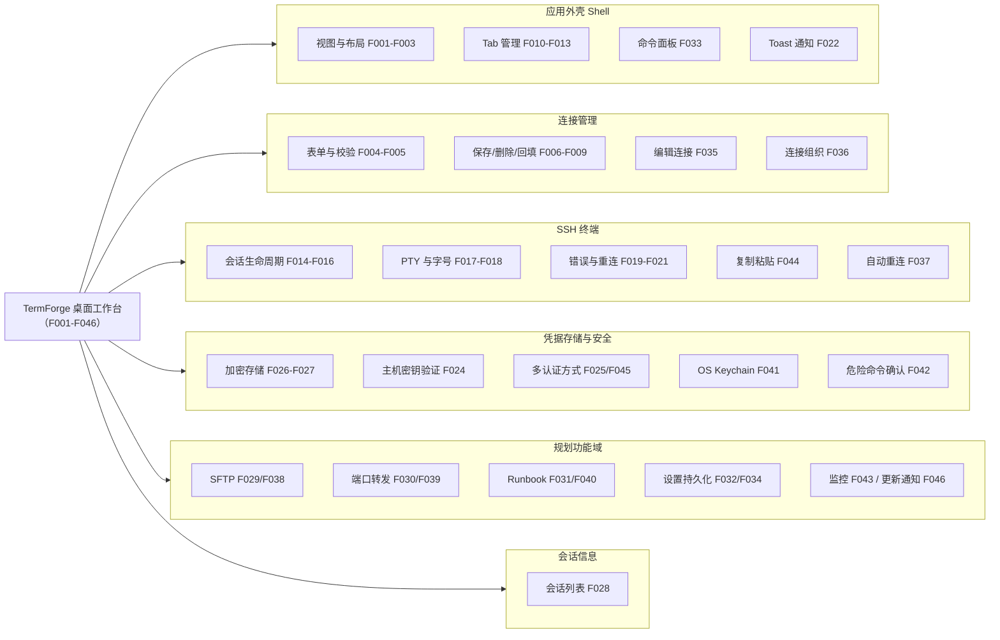

# TermForge 产品能力树（FEATURE MAP）

> 版本：v1.0（2026-09-03，按《旧 App AI 重构 SOP v2.0》P8 产物补齐）
> 来源：功能 ID 与名称、优先级、状态全部取自 `docs/02_product/PRD.md` §5 功能列表（F001-F046，与 `docs/01_reverse/REVERSE_ANALYSIS.md` ⑤功能清单表对齐）；分组为按功能语义的归类重组（映射关系保持 1:1，无增删）。
> 优先级：P0 = 重开发必须先有（行为基线或 MVP 必做）；P1 = MVP 必做但旧项目未实现；P2 = 规划增强。
> 状态：已实现 = 旧项目代码已具备；规划 = 仅有占位/类型预留/纯文档规划。

---

## 1. 能力树总览（Mermaid）

## 2. 分组明细表

### 2.1 应用外壳（Shell）

| ID | 名称 | 优先级 | 状态 | 备注 |
|---|---|---|---|---|
| F001 | 活动栏视图切换 | P0 | 已实现 | 5 个视图图标按钮，重复点击折叠侧栏 |
| F002 | 侧栏折叠/展开 | P0 | 已实现 | 折叠按钮 + Ctrl+\ + 活动栏重复点击，三入口 |
| F003 | 侧栏拖拽调宽 | P0 | 已实现 | 拖右缘 180-400px，读 CSS token 约束 |
| F010 | 新建 Tab 引导 | P0 | 已实现 | Ctrl+T / + 按钮 → 切到连接中心并展开侧栏 |
| F011 | 关闭 Tab | P0 | 已实现 | Ctrl+W / × → session_close → 移除 Tab → 激活相邻 |
| F012 | Tab 切换 | P0 | 已实现 | 点击 / Ctrl+1..9 / Ctrl+Tab 循环切换 |
| F013 | Tab 重命名 | P0 | 已实现 | 双击行内编辑，Enter 确认/Esc 取消/blur 提交 |
| F033 | 命令面板 | P2 | 规划（壳已实现） | 占位壳已有 → 真实命令集+搜索 |
| F022 | Toast 通知 | P0 | 已实现 | 3 类、3s 自动消失、点击关闭 |

### 2.2 连接管理

| ID | 名称 | 优先级 | 状态 | 备注 |
|---|---|---|---|---|
| F004 | 连接表单与校验 | P0 | 已实现 | host/port/username/password，失焦+提交校验，端口 1-65535 |
| F005 | 发起连接 | P0 | 已实现 | Connect 按钮/表单 Enter，校验通过创建 Tab 并连接 |
| F006 | 保存连接 | P0 | 已实现 | 查重（name 或 host+port+username）→ 加密落盘 → Toast |
| F007 | 删除连接 | P0 | 已实现 | confirm 确认 → 删除 → Toast → 刷新列表 |
| F008 | 选择连接回填 | P0 | 已实现 | 下拉/列表单击/Enter 回填表单并高亮 |
| F009 | 双击快速连接 | P0 | 已实现 | 列表项双击 = 回填 + 立即 Connect |
| F035 | 编辑连接 | P1 | 规划（后端能力在） | 后端按 id 更新已有，UI 需补编辑入口 |
| F036 | 连接组织 | P2 | 规划 | 分组/标签/搜索/最近使用/导入导出 |

### 2.3 SSH 终端

| ID | 名称 | 优先级 | 状态 | 备注 |
|---|---|---|---|---|
| F014 | 终端连接流程 | P0 | 已实现 | connecting → session_open（15s 超时）→ connected |
| F015 | 终端输入 | P0 | 已实现 | onData → session_send |
| F016 | 终端输出渲染 | P0 | 已实现 | app_event terminal:data → xterm write |
| F017 | PTY 尺寸同步 | P0 | 已实现 | fit → session_resize（连接后/窗口变化/字号变化） |
| F018 | 终端字号调整 | P0 | 已实现 | 状态栏菜单 10-20px，即时生效 |
| F019 | 错误友好提示 | P0 | 已实现 | 6 种错误映射（拒绝/认证/超时/DNS/不可达/兜底） |
| F020 | 手动重连 | P0 | 已实现 | error/closed 态显示 Reconnect 按钮 |
| F021 | 状态栏状态展示 | P0 | 已实现 | 五态标签 + 颜色点 |
| F023 | 真实 SSH 连接 | P0 | 已实现 | ssh2：TCP+握手+认证+PTY(xterm-256color)+shell |
| F044 | 复制粘贴 | P1 | 规划 | 终端复制/粘贴 |
| F037 | 自动重连 | P2 | 规划 | 断线自动重连（事件枚举 reconnecting 已预留） |

### 2.4 凭据存储与安全

| ID | 名称 | 优先级 | 状态 | 备注 |
|---|---|---|---|---|
| F024 | 主机密钥验证 | P0 | 已实现 | TOFU 首录 + 变更检测（MITM 告警） |
| F025 | 多认证方式 | P0 | 已实现（UI 仅密码） | 密码 / key_path / ~/.ssh 默认密钥探测 |
| F026 | 密码加密存储 | P0 | 已实现（含降级缺陷） | AES-256-GCM 机器绑定密钥（重开发应去除明文降级） |
| F027 | 连接持久化 | P0 | 已实现 | ~/.termforge/connections.json，0600 |
| F045 | 密钥认证 UI | P1 | 规划 | ConnectionForm 增加 key_path 选择 |
| F041 | OS Keychain | P2 | 规划 | keyring-rs 集成替代机器绑定密钥 |
| F042 | 危险命令确认 | P2 | 规划 | rm -rf 等确认规则 |

### 2.5 规划功能域（SFTP / 隧道 / Runbook / 设置 / 监控）

| ID | 名称 | 优先级 | 状态 | 备注 |
|---|---|---|---|---|
| F029 | SFTP 视图 | P1 | 规划 | 侧栏 SFTP 空状态 → 双栏文件管理（FR21-30） |
| F038 | SFTP 传输 | P1 | 规划 | 上传/下载/进度/删除/重命名/新建目录/权限 |
| F030 | 隧道视图 | P1 | 规划 | 侧栏 Tunnel 空状态 → Local Forward/SOCKS5（FR31-34） |
| F039 | 端口转发 | P1 | 规划 | Local Forward + SOCKS5 |
| F031 | Runbook 视图 | P1 | 规划 | 侧栏 Runbook 空状态 → 模板/批量执行/历史（FR35-44） |
| F040 | Runbook 引擎 | P1 | 规划 | 定义/参数化/多主机/历史/停止 |
| F032 | 设置视图 | P1 | 规划 | 侧栏 Settings 空状态 → 字号/主题/默认参数持久化（FR47/49） |
| F034 | 设置持久化 | P1 | 规划 | 偏好跨会话保存 |
| F043 | 监控面板 | P2 | 规划 | CPU/内存/磁盘/网络快照（事件类型已预留） |
| F046 | 应用更新通知 | P2 | 规划 | 检测新版本通知（FR48） |

### 2.6 会话信息

| ID | 名称 | 优先级 | 状态 | 备注 |
|---|---|---|---|---|
| F028 | 会话列表 | P1 | 后端有/前端未接 | session_list 命令已注册，前端从未调用 |

## 3. 统计与结构事实

- 总计 46 项（F001-F046）：已实现 28 项（F001-F028，均为 P0 行为基线，其中 F025/F026 带括注缺陷）；规划 18 项（F029-F046：P1 12 项 / P2 6 项，其中 F033 壳已实现、F035 后端能力在）。（来源：PRD §5 表逐行统计）
- 优先级分布：P0 × 28、P1 × 12、P2 × 6。（同上）
- 占位视图对应：F029-F032 四个视图在旧项目中均为 EmptyState 占位（REVERSE_ANALYSIS §③ PAGE004-007）。

## 4. 能力树的重开发决策关联（引评审结论，不新增结论）

- 取舍四档建议（docs/product-review/PRODUCT_LOGIC_REVIEW.md §四）：一档必做 F044/F035/F034；二档应做 F045/F033；三档用户决策 F029-F031/F038-F040；四档暂缓 F036（轻量搜索除外）/F037/F042/F043/F046；F041 Keychain 单列（与 DS-01 解密失败吞密码因果关联）。
- 上述取舍为评审建议，**最终范围待用户确认**（P4 C-1 / PL-01）。
