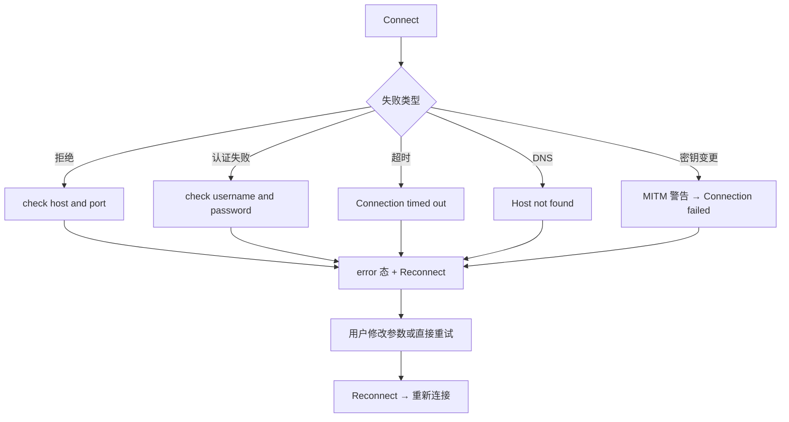
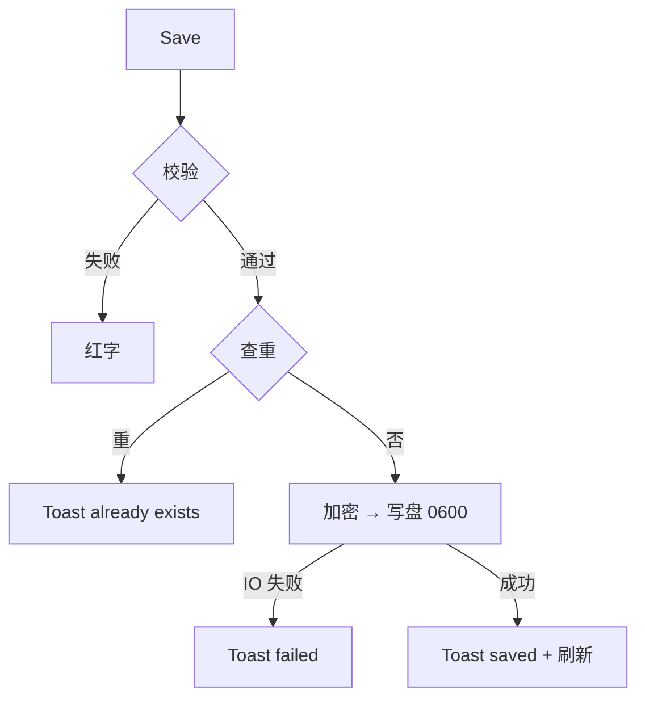

# TermForge 产品需求文档（PRD）

> 版本：v1.0（2026-09-02）
> 基线：本文档由旧项目代码逆向生成，功能范围 = 旧项目已实现能力 + 既有规划文档（《产品需求.md》《_bmad-output/planning-artifacts/epics.md》）中明确规划但未实现的能力（后者标注"规划"）。
> 功能 ID 与《docs/01_reverse/REVERSE_ANALYSIS.md》⑤功能清单表对齐。
> 本 PRD 用于指导"基于旧项目重新开发"，因此同时收录已实现（作为必须保持的行为基线）与规划能力（作为待实现范围）。

---

## 1. 产品介绍

**TermForge**（规划仓库名 `lys-term-forge`）是一个跨平台桌面运维工作台，面向开发者和运维人员，把 SSH 会话、SFTP 文件管理、端口转发、Runbook 批量执行和本地安全存储整合到一个桌面应用中。

**产品形态**：Tauri 2 桌面应用（Windows / macOS / Linux），单主窗口，VS Code 风格布局（活动栏 + 侧栏 + Tab 条 + 内容区 + 状态栏），窗口默认 1200×800（最小 800×500）。

**一句话定位**：不是"又一个终端"，而是把常见运维动作收进一个桌面工作台。

**当前旧项目实现水位**（逆向结论）：应用外壳、连接中心、真实 SSH 终端主链路（含主机密钥 TOFU 验证、多认证方式、PTY 同步、五态状态机）已实现；SFTP / 隧道 / Runbook / 设置为空状态占位；命令面板为占位实现。

## 2. 用户画像

| 画像 | 描述 | 核心诉求 | 来源 |
|---|---|---|---|
| P1 高频 SSH 开发者 | 每天连接多台开发/测试机的后端/全栈工程师 | 快速连接、多 Tab 并行、连接配置复用、断线可见可重连 | 产品需求.md §3 |
| P2 运维人员 | 管理批量服务器，执行巡检/发布脚本 | 连接中心 + Runbook 批量执行 + SFTP 传文件 + 执行历史 | 同上 |
| P3 独立开发者/小团队 | 无企业级堡垒机预算 | 本地加密存储凭据、单机可用、无云依赖 | 同上 |
| P4 记录型用户 | 希望统一管理连接和操作记录 | 连接档案、操作留痕（Runbook 执行历史） | 同上 |

## 3. 使用场景

| 场景 | 流程 | 涉及能力 |
|---|---|---|
| S1 日常登录排查 | 打开应用 → 双击已存连接 → 终端中敲命令 → 关 Tab | 连接中心、终端、持久化 |
| S2 首次连接新机器 | 填 host/port/username/password → Connect → 首次主机密钥 TOFU 记录 → 保存连接 | 表单校验、TOFU、加密存储 |
| S3 连接失败处置 | 错误提示（认证失败/拒绝/超时等友好文案）→ 检查参数 → Reconnect 重试 | 错误映射、重连 |
| S4 会话中断 | 远端关闭/网络错误 → 状态变 closed/error + 终端提示 → 重连或关闭 | 状态机、事件流 |
| S5 传文件（规划） | 连接后切 SFTP 视图 → 双栏浏览 → 上传/下载/进度 | SFTP（未实现，重开发范围） |
| S6 批量执行（规划） | Runbook 列表 → 选主机 → 执行 → 步骤级进度 → 停止/历史 | Runbook（未实现，重开发范围） |
| S7 内网穿透（规划） | 隧道视图建 Local Forward / SOCKS5 → 启停与状态 | 端口转发（未实现，重开发范围） |

## 4. 功能架构

```text
TermForge 桌面应用
├── 应用外壳（Shell）
│   ├── 活动栏（Connections / SFTP / Tunnel / Runbook / Settings 五视图）
│   ├── 侧栏（可折叠 Ctrl+\、拖宽 180-400px、按视图渲染内容）
│   ├── Tab 条（状态点/重命名/关闭/新建）
│   ├── 内容区（终端 Tabs / 空态）
│   ├── 状态栏（连接状态、UTF-8、字号菜单）
│   ├── 命令面板（Ctrl+Shift+P，规划：真实命令集）
│   └── Toast 通知（success/error/info）
├── 连接中心
│   ├── 连接表单（校验/Connect/Save）
│   ├── 已存连接（选择/双击连/删除/查重）
│   └── 规划：编辑、分组标签、搜索、导入导出
├── SSH 终端
│   ├── 会话生命周期（15s 超时、五态）
│   ├── 输入/输出流（事件驱动）
│   ├── PTY resize 同步、字号调整
│   ├── 错误友好提示 + Reconnect
│   └── 规划：自动重连、复制粘贴
├── SFTP（规划：双栏浏览/上传下载/进度/远端管理）
├── 端口转发（规划：Local Forward/SOCKS5/启停状态）
├── Runbook（规划：模板/参数化/批量执行/历史/停止）
└── 安全与存储
    ├── connections.json（AES-256-GCM 加密密码，0600）
    ├── known_hosts（TOFU，SHA-256 指纹，0600）
    └── 规划：OS Keychain、危险命令确认、设置持久化
```

后端架构分层：`commands/（Tauri 命令，薄）→ core/（session_manager / ssh / crypto）→ models/（DTO + app_event 事件枚举）`。事件系统：单一 `app_event` 事件名 + type 标签分发。

## 5. 功能列表

优先级定义：P0 = 重开发必须先有（旧项目已实现的行为基线或 MVP 必做）；P1 = MVP 必做但旧项目未实现；P2 = 规划增强。
状态：已实现 = 旧项目代码已具备（重开发需保持同等行为）；规划 = 旧项目仅有占位/类型预留/纯文档规划。

| 功能ID | 名称 | 描述 | 优先级 | 状态 |
|---|---|---|---|---|
| F001 | 活动栏视图切换 | 5 个视图图标按钮，点击切换，重复点击折叠侧栏 | P0 | 已实现 |
| F002 | 侧栏折叠/展开 | 折叠按钮 + Ctrl+\ + 活动栏重复点击，三入口 | P0 | 已实现 |
| F003 | 侧栏拖拽调宽 | 拖右缘 180-400px，读 CSS token 约束 | P0 | 已实现 |
| F004 | 连接表单与校验 | host/port/username/password，失焦+提交校验，端口 1-65535 | P0 | 已实现 |
| F005 | 发起连接 | Connect 按钮/表单 Enter，校验通过创建 Tab 并连接 | P0 | 已实现 |
| F006 | 保存连接 | 查重（name 或 host+port+username）→ 加密落盘 → Toast | P0 | 已实现 |
| F007 | 删除连接 | confirm 确认 → 删除 → Toast → 刷新列表 | P0 | 已实现 |
| F008 | 选择连接回填 | 下拉/列表单击/Enter 回填表单并高亮 | P0 | 已实现 |
| F009 | 双击快速连接 | 列表项双击 = 回填 + 立即 Connect | P0 | 已实现 |
| F010 | 新建 Tab 引导 | Ctrl+T / + 按钮 → 切到连接中心并展开侧栏 | P0 | 已实现 |
| F011 | 关闭 Tab | Ctrl+W / × → session_close → 移除 Tab → 激活相邻 | P0 | 已实现 |
| F012 | Tab 切换 | 点击 / Ctrl+1..9 / Ctrl+Tab 循环切换 | P0 | 已实现 |
| F013 | Tab 重命名 | 双击进入行内编辑，Enter 确认/Esc 取消/blur 提交 | P0 | 已实现 |
| F014 | 终端连接流程 | connecting → session_open（15s 超时）→ connected | P0 | 已实现 |
| F015 | 终端输入 | onData → session_send | P0 | 已实现 |
| F016 | 终端输出渲染 | app_event terminal:data → xterm write | P0 | 已实现 |
| F017 | PTY 尺寸同步 | fit → session_resize（连接后/窗口变化/字号变化） | P0 | 已实现 |
| F018 | 终端字号调整 | 状态栏菜单 10-20px，即时生效 | P0 | 已实现 |
| F019 | 错误友好提示 | 6 种错误映射（拒绝/认证/超时/DNS/不可达/兜底） | P0 | 已实现 |
| F020 | 手动重连 | error/closed 态显示 Reconnect 按钮 | P0 | 已实现 |
| F021 | 状态栏状态展示 | 五态标签 + 颜色点 | P0 | 已实现 |
| F022 | Toast 通知 | 3 类、3s 自动消失、点击关闭 | P0 | 已实现 |
| F023 | 真实 SSH 连接 | ssh2：TCP+握手+认证+PTY(xterm-256color)+shell | P0 | 已实现 |
| F024 | 主机密钥验证 | TOFU 首录 + 变更检测（MITM 告警） | P0 | 已实现 |
| F025 | 多认证方式 | 密码 / key_path / ~/.ssh 默认密钥探测 | P0 | 已实现（UI 仅密码） |
| F026 | 密码加密存储 | AES-256-GCM 机器绑定密钥（重开发应去除明文降级） | P0 | 已实现（含降级缺陷） |
| F027 | 连接持久化 | ~/.termforge/connections.json，0600 | P0 | 已实现 |
| F028 | 会话列表 | session_list 命令 | P1 | 后端有/前端未接 |
| F029 | SFTP 视图 | 侧栏 SFTP 空状态 → 双栏文件管理（FR21-30） | P1 | 规划 |
| F030 | 隧道视图 | 侧栏 Tunnel 空状态 → Local Forward/SOCKS5（FR31-34） | P1 | 规划 |
| F031 | Runbook 视图 | 侧栏 Runbook 空状态 → 模板/批量执行/历史（FR35-44） | P1 | 规划 |
| F032 | 设置视图 | 侧栏 Settings 空状态 → 字号/主题/默认参数持久化（FR47/49） | P1 | 规划 |
| F033 | 命令面板 | 占位壳已有 → 真实命令集+搜索 | P2 | 规划（壳已实现） |
| F034 | 设置持久化 | 偏好跨会话保存 | P1 | 规划 |
| F035 | 编辑连接 | 后端按 id 更新已有，UI 需补编辑入口 | P1 | 规划（后端能力在） |
| F036 | 连接组织 | 分组/标签/搜索/最近使用/导入导出（FR5/6） | P2 | 规划 |
| F037 | 自动重连 | 断线自动重连（事件枚举 reconnecting 已预留） | P2 | 规划 |
| F038 | SFTP 传输 | 上传/下载/进度/删除/重命名/新建目录/权限 | P1 | 规划 |
| F039 | 端口转发 | Local Forward + SOCKS5 | P1 | 规划 |
| F040 | Runbook 引擎 | 定义/参数化/多主机/历史/停止 | P1 | 规划 |
| F041 | OS Keychain | keyring-rs 集成替代机器绑定密钥（AR3） | P2 | 规划 |
| F042 | 危险命令确认 | rm -rf 等确认规则 | P2 | 规划 |
| F043 | 监控面板 | CPU/内存/磁盘/网络快照（事件类型已预留） | P2 | 规划 |
| F044 | 复制粘贴 | 终端复制/粘贴（FR19/20） | P1 | 规划 |
| F045 | 密钥认证 UI | ConnectionForm 增加 key_path 选择 | P1 | 规划 |
| F046 | 应用更新通知 | 检测新版本通知（FR48） | P2 | 规划 |

## 6. 页面需求

> 页面编号与逆向报告③一致。每页给出：编号/目标/入口/展示内容/操作/响应/状态/异常。

### PAGE001 应用主工作台
- **编号**：PAGE001（对应 F001/F002/F003/F010-F013）
- **目标**：承载五视图布局与 Tab 生命周期，提供全局快捷键。
- **入口**：应用启动。
- **展示内容**：活动栏（5 图标）、侧栏、Tab 条、内容区、状态栏、（浮层：命令面板/Toast）。
- **操作**：视图切换、侧栏折叠/拖宽、快捷键 9 组（Ctrl+1..9/Ctrl+T/Ctrl+W/Ctrl+Tab±/Ctrl+\/Ctrl+Shift+P/Ctrl+Shift+N/Esc）。
- **响应**：视图切换渲染对应侧栏内容；Ctrl+T 转到连接中心；Ctrl+W 关当前 Tab。
- **状态**：activeView×5、collapsed、tabs 数组、activeTabId、fontSize。
- **异常**：连接列表加载失败静默；session_close 失败 Toast 但 Tab 仍移除。

### PAGE002 连接中心
- **编号**：PAGE002（对应 F004-F009、F035、F036、F045）
- **目标**：输入/选择连接参数，发起连接或保存。
- **入口**：活动栏 Connections / Ctrl+T / Ctrl+Shift+N（聚焦 Host）。
- **展示内容**：已存连接下拉 + 列表（名称、删除×）、Host/Port/Username/Password 表单、Connect/Save 按钮。
- **操作**：填写（失焦校验）、Connect、Save、删除（confirm）、选择回填、双击直连、Enter 直连。
- **响应**：Connect 创建 Tab；Save 查重→加密→Toast；删除后列表刷新。
- **状态**：表单错误提示（touched 后显示）、submitting（按钮禁用）、列表选中高亮。
- **异常**：校验失败（红字）；查重失败（Toast already exists）；保存/删除失败（Toast error）；列表空（隐藏下拉与列表，仅表单）。

### PAGE003 终端会话页
- **编号**：PAGE003（对应 F014-F021、F023-F025、F037/F044）
- **目标**：单条 SSH 会话的交互终端。
- **入口**：连接发起后自动创建 Tab。
- **展示内容**：xterm 终端（5000 行回滚、光标闪烁）、错误时 Reconnect 条。
- **操作**：键盘输入、Reconnect。
- **响应**：输入实时发送；输出实时渲染；状态变化同步 Tab 点与状态栏。
- **状态**：idle/connecting（"Connecting..."+黄点脉冲）/connected（绿点）/closed（灰点+终端 [status] 行）/error（红点+红字错误+Reconnect）。
- **异常**：6 种错误映射 + 15s 超时；远端 EOF → closed；读错误 → error+Read error；写错误 → error 提示但不断连；主机密钥变更 → 连接失败含 MITM 警告。

### PAGE004 SFTP 视图（规划实现）
- **编号**：PAGE004（对应 F029/F038）
- **目标**：已连接会话的远端文件管理。
- **入口**：活动栏 SFTP。
- **展示内容**：当前为空状态（"No active SFTP session"）；规划：本地/远端双栏、进度条。
- **操作**：规划：浏览/上传/下载/删除/重命名/新建目录。
- **状态**：空（无会话）/已连接列表/传输中（进度）/错误。
- **异常**：规划：传输失败、校验失败提示。

### PAGE005 隧道视图（规划实现）
- **编号**：PAGE005（对应 F030/F039）
- **目标**：端口转发规则管理。当前空状态 "No tunnels configured"。
- **操作**：规划：新建规则（Local/SOCKS5）、启停、删除、查看状态。

### PAGE006 Runbook 视图（规划实现）
- **编号**：PAGE006（对应 F031/F040）
- **目标**：命令模板批量执行。当前空状态 "No runbooks yet"。
- **操作**：规划：新建/编辑/删除/预览/选主机执行/步骤进度/停止/历史。

### PAGE007 设置视图（规划实现）
- **编号**：PAGE007（对应 F032/F034/F042）
- **目标**：应用偏好。当前空状态 "Settings"。
- **操作**：规划：字号/主题/默认连接参数/危险命令规则，持久化保存。

### PAGE008 命令面板
- **编号**：PAGE008（对应 F033）
- **目标**：快速命令入口。当前占位（搜索框+placeholder 提示）。
- **入口**：Ctrl+Shift+P。
- **操作**：输入（规划：搜索过滤命令）、Esc/点击背景关闭。

### PAGE009 终端区空态
- **编号**：PAGE009
- **目标**：无 Tab 时引导用户建立连接。
- **展示内容**："No active terminals" + 引导文案。

### PAGE010 Toast 通知浮层
- **编号**：PAGE010（对应 F022）
- **目标**：操作反馈。3 类图标+色边，3s 自动消失，点击关闭，右下角栈式。

## 7. 业务流程（Mermaid）

### 7.1 核心正常流程：连接并使用终端


### 7.2 异常流程：连接失败与恢复



### 7.3 边界流程：保存查重与持久化



## 8. 验收标准（Given-When-Then）

> 已实现功能按旧项目行为基线验收；规划功能按规划需求验收（重开发阶段执行）。

**F001 视图切换**
- Given 用户在 Connections 视图，When 点击 SFTP 图标，Then 侧栏切换为 SFTP 内容且展开；When 再次点击 SFTP 图标，Then 侧栏折叠。

**F004 表单校验**
- Given Host 为空，When 触发 Connect，Then Host 下方显示 "Host is required" 且不发起连接。
- Given Port 输入 70000，When 触发 Connect，Then 显示 "Port must be 1-65535"。
- Given Host/Port/Username 均合法，When 触发 Connect，Then 无错误提示且创建 Tab。

**F005 发起连接**
- Given 表单合法，When 点击 Connect 或按 Enter，Then 创建新 Tab，标题为 username@host，状态 connecting，终端显示 "Connecting..."。

**F006 保存连接**
- Given 已存在 admin@1.2.3.4，When 再次保存相同 host+port+username，Then Toast 显示 already exists 且不写入。
- Given 保存成功，When 查看 connections.json，Then password 字段为 base64 密文且文件权限 0600。

**F007 删除连接**
- Given 已存连接列表有一项，When 点击 ×，Then 弹出 confirm；确认后列表移除该项并 Toast 成功。

**F009 双击直连**
- Given 已存连接存在，When 双击列表项，Then 表单回填并立即创建 Tab 连接。

**F011 关闭 Tab**
- Given 活动 Tab 处于 connected，When 按 Ctrl+W，Then 调用 session_close，Tab 移除，相邻 Tab 被激活；无其他 Tab 时显示空态页。

**F012 Tab 切换**
- Given 打开了 3 个 Tab 且激活第 1 个，When 按 Ctrl+3，Then 第 3 个 Tab 激活；When 按 Ctrl+9 而 Tab 数为 3，Then 激活第 3 个（钳制到最后）。

**F013 重命名**
- Given 任一 Tab，When 双击标题，Then 出现行内输入框；Enter 后标题更新，Esc 后取消不变。

**F014 连接流程**
- Given 目标主机可达且凭据正确，When 发起连接，Then 15 秒内状态变为 connected，终端清屏进入 shell。
- Given 主机不可达，When 发起连接，Then 15 秒后超时，状态 error，终端显示 "Connection timed out"。

**F016 输出渲染**
- Given 会话 connected，When 远端输出数据（app_event terminal:data），Then 终端实时追加显示对应文本。

**F017 PTY 同步**
- Given 会话 connected，When 拖拽窗口改变大小，Then 前端 fit 后调用 session_resize，远端 PTY 列行数更新。

**F018 字号**
- Given 状态栏字号菜单展开，When 选择 16px，Then 终端字体立即变为 16px 且 PTY 尺寸同步。

**F019/F020 错误与重连**
- Given 连接因密码错误失败，When 查看终端，Then 显示 "Authentication failed — check username and password" 且出现 Reconnect 按钮；When 点击 Reconnect，Then 重新进入 connecting 流程。

**F021 状态栏**
- Given 活动 Tab 为 connecting，When 查看状态栏，Then 显示 "Connecting... to username@host" 且状态点为黄色。

**F022 Toast**
- Given 保存连接成功，When 观察，Then 右下角出现 success Toast 并 3 秒后淡出；点击可立即关闭。

**F024 主机密钥**
- Given 首次连接某 host:port，When 连接成功，Then known_hosts 新增该指纹记录；Given 指纹已存在，When 服务端指纹变化，Then 连接失败且错误信息包含 MITM 警告。

**F025 认证**
- Given 只提供密码，When 连接，Then 走密码认证；Given 无密码无 key_path，When 连接，Then 依次探测 ~/.ssh/id_ed25519、id_rsa、id_ecdsa，全部失败时报 "no password provided and no suitable SSH key found"。

**F026 加密**
- Given 同一密码加密两次，When 比较密文，Then 不同（随机 nonce）；When 解密，Then 还原明文（crypto.rs 单元测试已覆盖）。

**F029-F031 三大规划视图（重开发验收）**
- Given 未连接任何会话，When 切换 SFTP/Tunnel/Runbook 视图，Then 显示对应空状态与引导文案（当前即验收此占位行为）；规划功能落地后按 FR21-44 逐条补充 Given-When-Then。

**F033 命令面板**
- Given 任意时刻，When 按 Ctrl+Shift+P，Then 面板打开并聚焦搜索框；When 按 Esc 或点击背景，Then 关闭。
