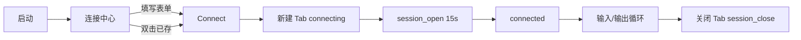
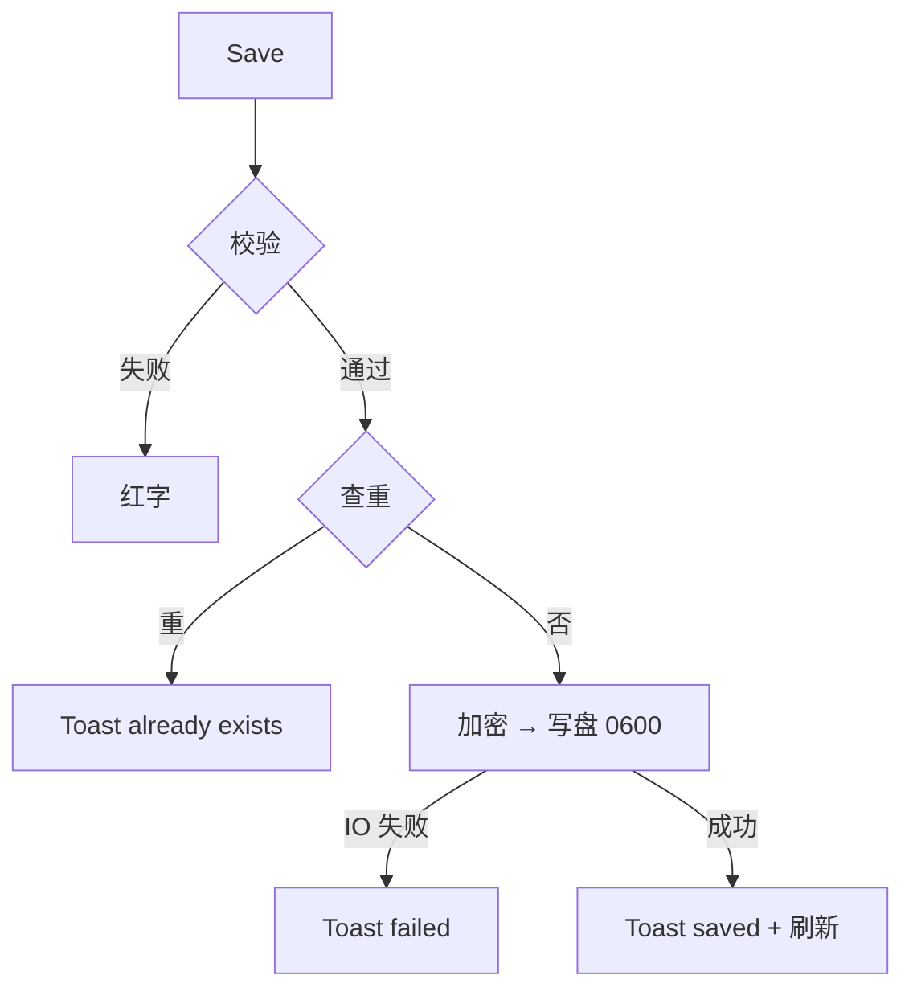
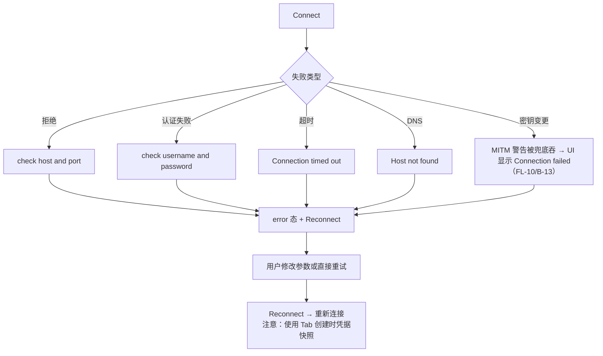
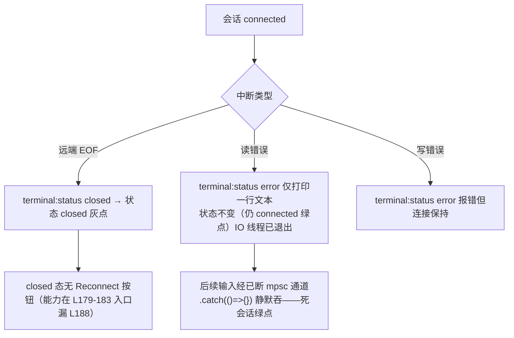
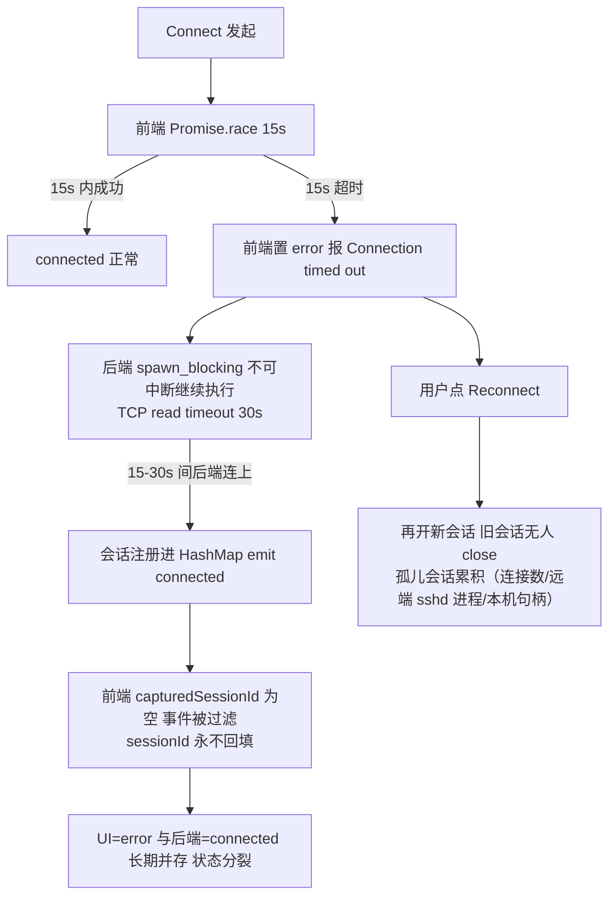
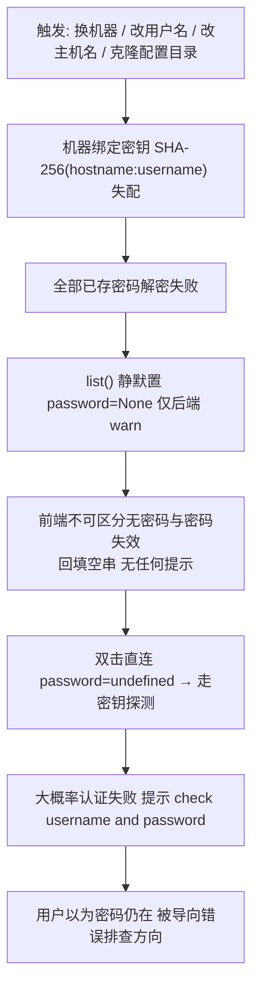
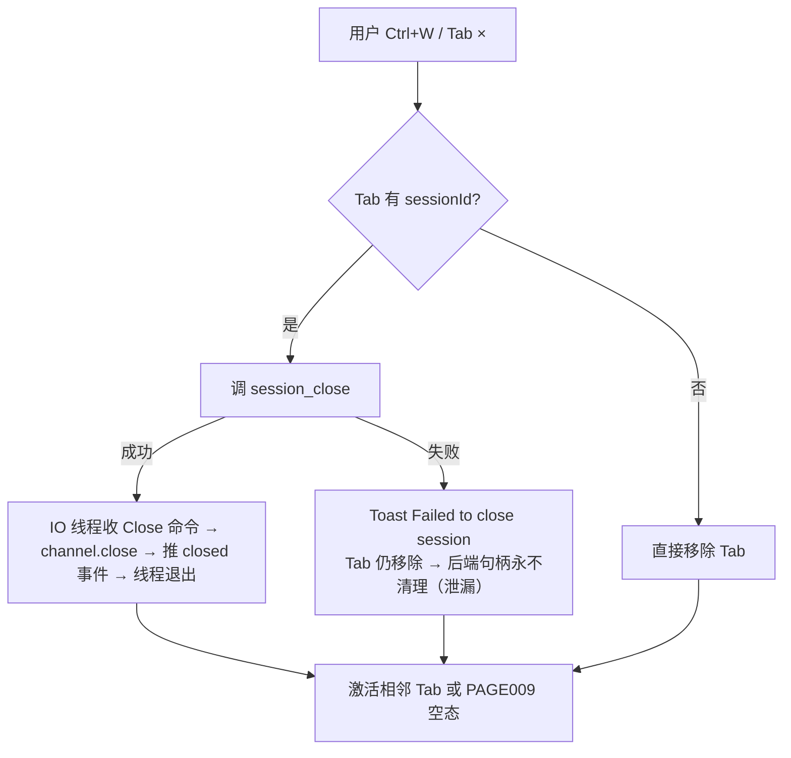

# TermForge 业务流程（BUSINESS FLOW）——正常 / 异常 / 边界

> 版本：v1.0（2026-09-03，按《旧 App AI 重构 SOP v2.0》P8 产物补齐）
> 内容来源：流程事实取自 `docs/01_reverse/REVERSE_ANALYSIS.md` §⑥ 与 `docs/02_product/PRD.md` §7；已知缺陷标注取自 `docs/product-review/` 六件套（ST/DS/UF/PL 编号）与 `docs/06_review/PRODUCT_REVIEW.md`（FL/C 编号）。缺陷为源码既有事实的如实登记，非本文新增判断。

---

## 1. 正常流程（Happy Path）

### 1.1 连接并使用终端（PRD §7.1）

- 链路：双击直连 2 步可用，主链路健康（USER_FLOW_REVIEW.md F1）。
- 输入 → session_send → IO 线程（5ms 轮询）→ app_event terminal:data → xterm write 实时渲染（REVERSE_ANALYSIS §②）。

### 1.2 保存/删除连接（PRD §7.3）

- 删除：confirm → delete → Toast → 刷新，链路完整（F6 通过五要素核查）。

## 2. 异常流程（连接失败与恢复，PRD §7.2 + 已知缺陷）

异常流程已知缺陷登记（重开发规格必须覆盖）：

| # | 缺陷 | 证据 | 编号/分级 |
|---|---|---|---|
| 1 | 错误提示 "Press Ctrl+R..." 为死文案（快捷键未注册；终端聚焦时 Ctrl+R 反而透传给远端 shell 触发反向搜索历史） | TerminalTab L166 vs App.svelte 快捷键表 | FL-01 / B-04（B 类） |
| 2 | 主机密钥变更（MITM）错误被 friendlyError 兜底吞掉，处置指引（删 known_hosts 条目）全丢 | TerminalTab L105-113 六分支无 Host key mismatch | FL-10 / B-13（B 类） |
| 3 | 凭据轮换三重锁死：Reconnect 用快照 + 无编辑入口 + Save 恒生成新 UUID（后端按 id 更新能力前端不可达）+ 查重拦截 → 唯一出路关 Tab 重填（6 步） | App.svelte L17-28、ConnectionForm L67-77、store.rs L114-115 | UF-01（B 类） |
| 4 | 密钥认证失败提示错位：无密码无密钥场景被导向"check username and password" | client.rs L181-185 → TerminalTab L108 | UF-05（D 类） |

## 3. 边界流程（含系统性已知缺陷标注）

### 3.1 远端断开与运行时错误

已知缺陷登记：

| # | 缺陷 | 证据 | 编号/分级 |
|---|---|---|---|
| 5 | **运行时 error 事件不进入状态机**：api.ts 类型联合不含 'error'（L7）+ TerminalTab 仅处理 closed（L132）→ 死会话显示绿点、输入静默丢弃、无提示无下一步无恢复 | api.ts L7、TerminalTab L130-133、client.rs L242-253 | **ST-01 / UF-02 / PL-05（B 类，P4 未覆盖，评审 Top1）** |
| 6 | closed 态重连转换存在但无 UI 触发器 | TerminalTab L188 仅 error 渲染 | ST-02 / FL-02 / B-05（B 类） |
| 7 | 非激活 Tab 断线无全局信号（看其他 Tab 时完全无感知） | 无 Toast、状态栏仅反映激活 Tab | FL-11（B-05 附带） |

### 3.2 慢连接 / 超时（ST-03 / UF-03，P4 未覆盖）

已知缺陷登记：**前端 15s 超时不是取消协议，只是放弃等待**——慢链路用户被误导去查网络（实际已连上），重连产生双会话与泄漏（TerminalTab L143-150、session_manager.rs L55-87）。分级 B 类（ST-03/UF-03）。

### 3.3 凭据存储读路径（DS-01，高频数据风险）

已知缺陷登记：**解密失败静默吞密码**（store.rs L88-91）——高频真实数据丢失场景；叠加 UF-01（无编辑入口+查重拦截）后用户被迫删除重建。分级 B 类（DS-01，评审 Top2）。写路径的加密失败明文降级（store.rs L104-107）触发条件近死且降级数据读不回（DS-02，PL-04 校准：优先级让位于 DS-01）。

### 3.4 关 Tab 清理（会话生命周期）

已知缺陷登记：close 失败时后端 SessionManager 句柄残留；且 IO 线程退出（EOF/读错误）后也无回调清理——`session_list` 对已死会话仍报 connected、句柄占用至应用退出（ST-04）。V1/API_SPEC 已按修复后规格呈现（close 先移除后关闭、幂等、保证回收——C-6）。另：远端断开后不关 Tab 的孤儿会话同 3.2/3.3 登记路径。

### 3.5 保存查重与持久化边界

| 边界场景 | 行为 | 来源 |
|---|---|---|
| 查重命中（name 或 host+port+username） | Toast already exists，不写入 | PRD §7.3 |
| 加密失败 | warn 后明文落盘（缺陷，见 3.3 登记；V1 修复后规格：拒绝保存报 E_ENCRYPT_FAILED 不落盘） | DS-02 / C-7 |
| connections.json 文件损坏 | list 返回空列表兜底（恒 Ok） | API_SPEC §2.6 |
| 存储无 schema 版本与密文标记，明文与密文不可区分 | 未来迁移无版本抓手 | DS-04（B 类） |
| known_hosts 指纹变更后 | 无产品内管理入口，唯一恢复方式是手工编辑 `~/.termforge/known_hosts` | DS-05（B 类） |

## 4. 边界与异常的规格化结论（引评审，不新增）

1. 异常三类口径核查（提示/下一步/恢复）：10 项中 6 项缺「下一步」或「恢复」（USER_FLOW_REVIEW.md §三）——8 条核心流程中 4 条不通过五要素核查（F3 凭据轮换/F5 中断/F7 慢连/F8 TOFU）。
2. 重开发 B 类规格应在 P4 的 13 条之上新增第 14 条：终端运行时错误处理链路（PL-05 = ST-01 + UF-02 的规格级表述）（PRODUCT_LOGIC_REVIEW.md §5.4）。
3. C-6（session_close 泄漏）应扩充为统一「会话生命周期规格」，纳入 ST-03 超时孤儿与 ST-04 断线残留两条新泄漏路径（同上）。
4. 凭据存储读写策略（DS-01 提示 + DS-02 拒绝保存）应打包为同一决策项提交用户（PL-04）。

## 5. 已知缺陷留档（补充：V1 HTML 原型层留档缺口，2026-09-03）

> 缘由：本节为追加登记（不改动上文既有内容）。下列两条缺陷的**真机源码级事实**上文已登记（①见 §3.1 表编号 5，②见 §3.2 文字登记）；本次补录的是 V1 HTML 原型验收（`docs/09_test/HTML_QA_REPORT.md` §四 P2-2，2026-09-03）发现的**原型层留档缺口**——V1 场景库（12 项）无对应场景、评审面板「后端事实与修复后规格」区列出的五项留档（session_list / 加密降级 / session_close / Ctrl+R / closed 重连）不含这两条，未按本项目「已知缺陷留档」惯例完整呈现。因缺陷实体与上文编号 5-7 同源，为免同一源码缺陷双重编号，按编号顺延（8、9）在本节单独登记，口径与 QA 报告 P2-2 一致。

| # | 缺陷 | 证据 | 编号/分级 |
|---|---|---|---|
| 8 | **运行时读错误不进状态机 / 死会话绿点**（USER_FLOW 旅程 4）：IO 线程读错误后状态不变（仍 connected 绿点），输入静默丢弃。V1 原型**未模拟**该缺陷（按 QA 报告口径不算模拟失真），且原型评审面板留档未列此条；重开发规格必须闭环 | HTML_QA_REPORT §四 P2-2 ①；真机源码级登记见 §3.1 编号 5（api.ts L7、TerminalTab L130-133、client.rs L242-253） | **ST-01 / UF-02**（含 PL-05，B 类） |
| 9 | **超时孤儿会话**：前端 15s 竞速超时后置 error，后端 session_open 继续执行并后台持有句柄（UI=error 与后端=connected 状态分裂，重连产生双会话/泄漏）。V1 原型**未模拟**（按 QA 报告口径不算模拟失真），原型评审面板留档未列此条；重开发规格必须闭环 | HTML_QA_REPORT §四 P2-2 ②；真机源码级登记见 §3.2（TerminalTab L143-150、session_manager.rs L55-87） | **ST-03 / UF-03**（B 类；QA 报告 P2-2 归入同一留档缺口） |

口径说明：QA 报告 P2-2 要求「重开发规格必须闭环 ST-01/UF-02」，两条同列本节以保持原型验收口径完整；重开发时一并落入规格化结论第 2/3 条（§4）所指的第 14 条 B 类规格与统一会话生命周期规格。
