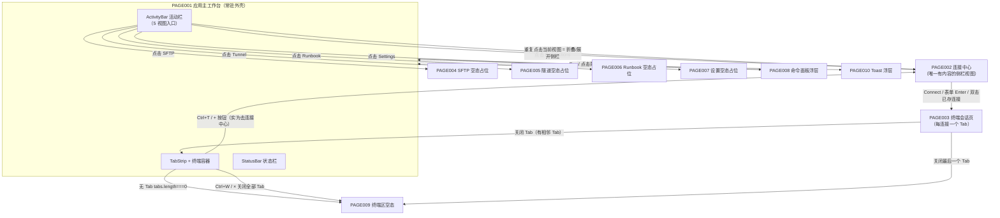

# TermForge 页面/视图跳转关系（PAGE FLOW）

> 版本：v1.0（2026-09-03，按《旧 App AI 重构 SOP v2.0》P8 产物补齐）
> 内容来源：页面清单与跳转关系全部取自 `docs/01_reverse/REVERSE_ANALYSIS.md` §③页面清单表 / §④页面详细分析 及 `docs/02_product/PAGE_SPEC.md` §1 各页「跳转关系」行；导航层级经 `docs/product-review/INFORMATION_ARCHITECTURE_REVIEW.md` §一源码核实。桌面单窗口应用，"页面" = 窗口内的视图与浮层；无前端路由库（视图切换 = activeView 字符串，App.svelte L43、L254-264）。

---

## 1. 页面总表与入口/出口

| 编号 | 页面 | 入口（进入条件） | 出口（跳出去向） | 文件 | 状态 |
|---|---|---|---|---|---|
| PAGE001 | 应用主工作台（外壳） | 应用启动（常驻，其他页面在其区域内呈现） | 到 PAGE002/004/005/006/007（侧栏视图切换）、PAGE003（创建 Tab）、PAGE008（Ctrl+Shift+P）、PAGE009（关闭全部 Tab） | `src-ui/src/App.svelte` | 已实现 |
| PAGE002 | 连接中心 | 活动栏 Connections 按钮 / Ctrl+T / Ctrl+Shift+N（聚焦 Host） | Connect/双击直连 → PAGE003（新 Tab）；无其他跳转 | `ConnectionForm.svelte` + `SidePanel.svelte` | 已实现 |
| PAGE003 | 终端会话页（单 Tab） | Connect 发起 / 已存连接双击 → App 创建 Tab（仅激活 Tab display:flex） | 无直接跳转；关闭 Tab 回 PAGE001/PAGE009 | `TerminalTab.svelte` | 已实现 |
| PAGE004 | SFTP 视图 | 活动栏 SFTP 图标 | 无（空状态占位） | `SidePanel.svelte` L149（EmptyState） | 占位 |
| PAGE005 | 隧道视图 | 活动栏 Tunnel 图标 | 无（空状态占位） | `SidePanel.svelte` L151 | 占位 |
| PAGE006 | Runbook 视图 | 活动栏 Runbook 图标 | 无（空状态占位） | `SidePanel.svelte` L153 | 占位 |
| PAGE007 | 设置视图 | 活动栏 Settings 图标 | 无（空状态占位） | `SidePanel.svelte` L155 | 占位 |
| PAGE008 | 命令面板（浮层） | Ctrl/Cmd+Shift+P（输入框/终端聚焦时除外） | 关闭后返回原界面（Esc/点击背景） | `CommandPalette.svelte` | 占位（仅搜索框） |
| PAGE009 | 终端区空态 | tabs.length === 0（关闭全部 Tab 后自动出现） | 无（纯展示引导） | `App.svelte` L297-302 | 已实现 |
| PAGE010 | Toast 通知浮层 | 任一 showToast 调用（保存/删除连接、关闭会话失败等） | 无（3s 自动消失/点击关闭） | `ToastContainer.svelte` + `lib/toast.ts` | 已实现 |

（来源：REVERSE_ANALYSIS §③；PAGE_SPEC §1 各页"进入条件/跳转关系"行，两者交叉核实一致）

## 2. 跳转关系图（Mermaid）

（跳转边来源：INFORMATION_ARCHITECTURE_REVIEW.md §一导航层级图（经源码核实）+ PAGE_SPEC §1 PAGE001 跳转关系行 + REVERSE_ANALYSIS §④ PAGE001/002/003。虚线 = 浮层非持久跳转。）

## 3. 视图切换与快捷键触达路径

| 触达方式 | 目标 | 行为 | 来源 |
|---|---|---|---|
| 活动栏点击 | PAGE002/004/005/006/007 | 同视图 → 折叠切换；异视图 → 切换并展开（App.svelte handleViewChange L254-264） | REVERSE_ANALYSIS §④ |
| Ctrl/Cmd+T、TabStrip + 按钮 | PAGE002 | 切到连接中心并展开侧栏（语义为"新建连接"引导，非创建空 Tab——FL-08/B-11） | 同上 |
| Ctrl/Cmd+Shift+N | PAGE002 | 新连接并聚焦 Host 输入框 | 同上 |
| Ctrl/Cmd+Shift+P | PAGE008 | 开关命令面板 | 同上 |
| Ctrl/Cmd+1..9 / Ctrl±Tab | PAGE003 各 Tab 间 | 切换/循环切换 Tab（钳制） | 同上 |
| Ctrl/Cmd+W | 离开 PAGE003 | 关当前 Tab → 激活相邻或 PAGE009 | 同上 |
| Ctrl/Cmd+\ | 侧栏折叠态 | 不切视图，仅折叠/展开 | 同上 |

注意（已知边界，来源：REVERSE_ANALYSIS §④ PAGE001）：快捷键处理器在焦点位于 HTMLInputElement/HTMLTextAreaElement/.xterm 时直接 return（终端/表单聚焦时全部让位——SSH 透传惯例，P4 F-07/D-2）；Ctrl+Tab/Ctrl+W 等浏览器保留组合键在 Tauri WebView 内的系统性拦截效果【未知——未实测】。

## 4. 跳转关系评审要点（引 INFORMATION_ARCHITECTURE_REVIEW.md，不新增结论）

1. **无「返回」「历史」概念**（单层视图模型，桌面工具合理）——IA §一。
2. **可预测性抽查 7 例仅 2 例完整命中（约 29%）**：字号设置在状态栏而非设置页（偏移）、编辑连接不可达、closed 态无重连入口（不一致）、删除弱可发现、「+」实为去连接中心（语义偏移）、connecting 不可取消（不可达）——IA §三。
3. **10 个页面中 4 个占位空态 + 1 个占位浮层**：IA 骨架按终局设计搭建，内容兑现度 50%（IA §二）——「占位视图是否常驻一级导航」属 IA-01（C 类）用户决策。
4. 层级深度 2 层 + 浮层独立，宽度 5 入口——骨架本身是好的 VS Code 范式移植（IA §四）。
