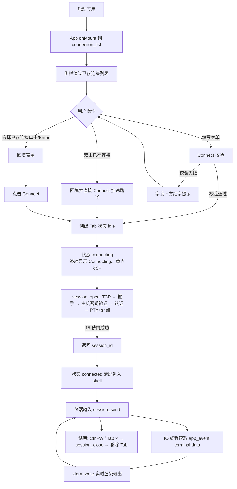
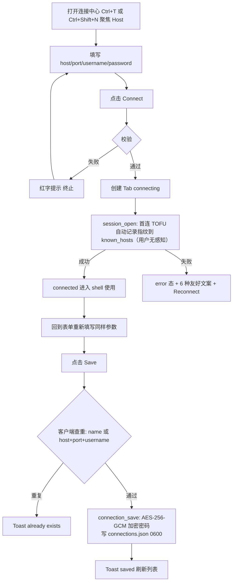
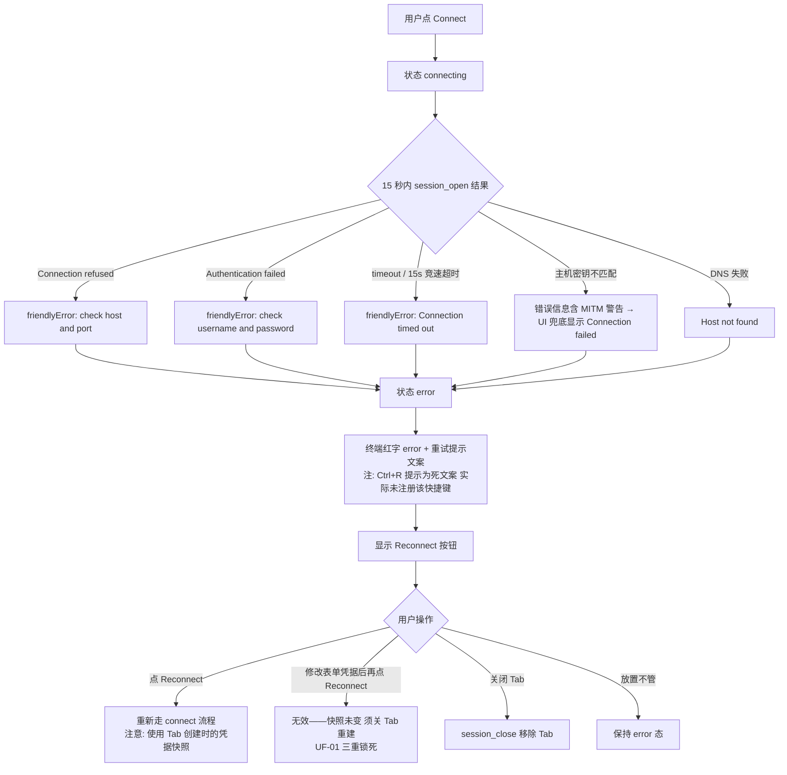
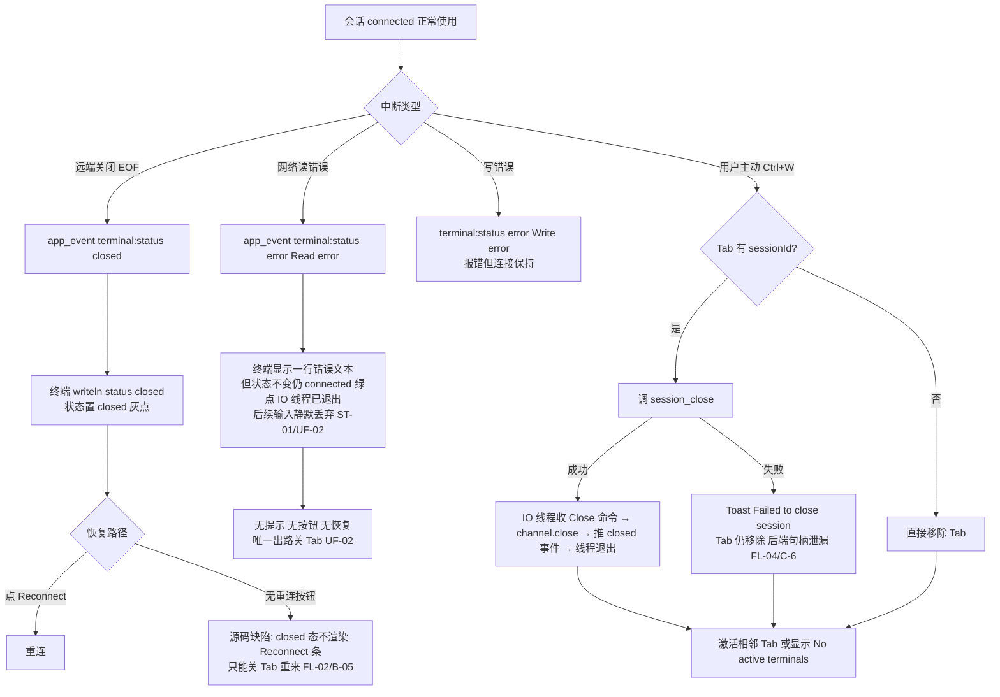
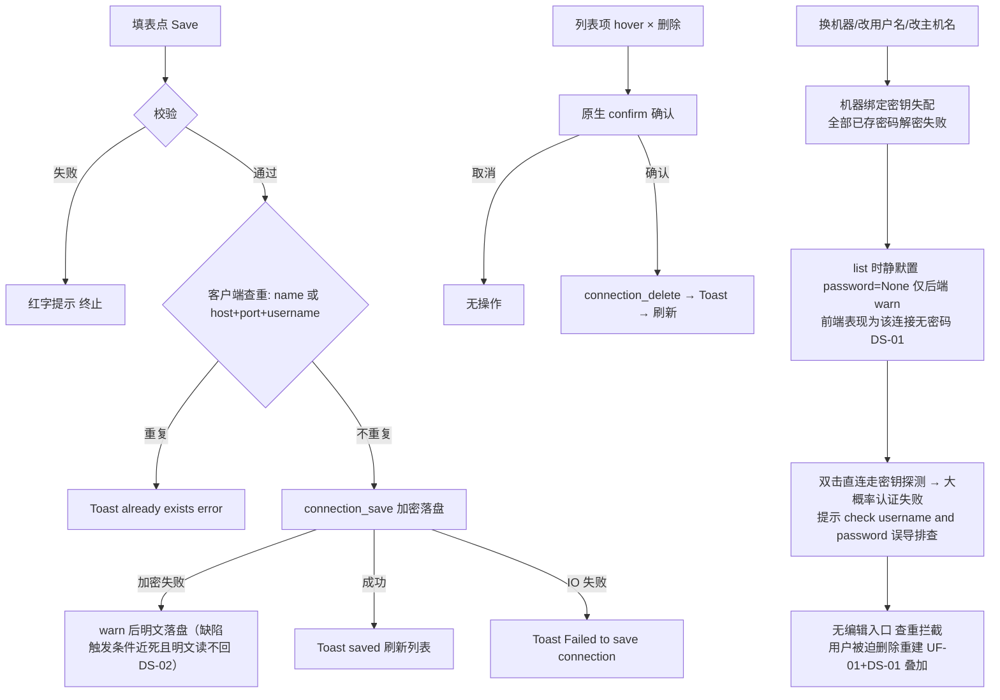

# TermForge 用户旅程（USER FLOW）

> 版本：v1.0（2026-09-03，按《旧 App AI 重构 SOP v2.0》P8 产物补齐）
> 内容来源：旅程步骤与判定分支全部取自 `docs/01_reverse/REVERSE_ANALYSIS.md` §⑥ 用户流程（Mermaid 四图）与 §④ 页面详细分析；画像/场景口径见 `docs/02_product/PRD.md` §2-3；异常恢复缺口引 `docs/product-review/USER_FLOW_REVIEW.md`（UF 编号）。流程图为源图重组，无新增行为。

---

## 旅程 1：P1 日常登录排查（场景 S1）——主链路（正常路径）

用户：高频 SSH 开发者，每天连多台机器。目标：最快进入远端 shell 干活。

**旅程要点**（来源：REVERSE_ANALYSIS §⑥ 流程 1；USER_FLOW_REVIEW.md F1）：
- 双击直连为主链路 2 步可用（回填+立即 dispatch connect，ConnectionForm L122-130），是产品当前最有价值的部分。
- 双击直连可发现性弱（仅 hover title 提示）——P4 F-06/B-07，V1 原型已按主机卡+Connect 快连按钮呈现。

## 旅程 2：P1/P2 首次连接新机器并保存（场景 S2）

用户目标：第一次连一台新机器，验证可连后留档复用。

**旅程要点**（来源：REVERSE_ANALYSIS §⑥ 流程 1 Save 分支 + 流程 4；USER_FLOW_REVIEW.md F2/UF-08）：
- 断点：连接成功后想保存，必须重新填写一遍刚输入的参数（Connect 不落盘、无保存引导）——现路径 8+ 步（UF-08，D 类观察）。
- 首连 TOFU 自动信任、用户全程无感知（client.rs L65-74）——PM-03/B-12 已建议升级为确认式 TOFU。

## 旅程 3：P1 连接失败处置（场景 S3）——异常路径

用户目标：连不上时快速定位原因并恢复。

**旅程要点**（来源：REVERSE_ANALYSIS §⑥ 流程 2；USER_FLOW_REVIEW.md F4/UF-01/UF-06）：
- 错误提示 "Press Ctrl+R..." 为死文案（全局快捷键表未注册 Ctrl+R）——P4 FL-01/B-04。
- 认证失败修正路径断裂：Reconnect 用 Tab 创建时的 connection 快照，改表单对已建 Tab 无效——UF-01（B 类，重开发须闭环）。
- 主机密钥变更（MITM）被 friendlyError 兜底吞掉——P4 FL-10/B-13，V1 已增第七条专案映射。

## 旅程 4：P1/P2 会话中断处置（场景 S4）——边界路径

用户目标：远端断开或网络错误后，尽快恢复会话。

**旅程要点**（来源：REVERSE_ANALYSIS §⑥ 流程 3；STATE_REVIEW.md ST-01/ST-02；USER_FLOW_REVIEW.md F5/UF-02）：
- closed 态重连能力存在但按钮未渲染（能力在、入口漏）——FL-02/B-05。
- 运行时读错误不进入状态机：死会话显示绿点、输入被 `.catch(() => {})` 静默吞——ST-01/UF-02/PL-05，P4 未覆盖，重开发规格必须补齐。
- 非激活 Tab 断线无全局信号（无 Toast）——FL-11/B-05 附带。

## 旅程 5：P3 凭据资产沉淀（保存/删除/跨机迁移）——数据生命周期路径

用户目标：把连接配置作为长期资产管理。

**旅程要点**（来源：REVERSE_ANALYSIS §⑥ 流程 4；DATA_STORAGE_REVIEW.md DS-01/DS-02；USER_FLOW_REVIEW.md 三类异常核查表）：
- 正常保存/删除链路完整（F6 通过五要素核查）。
- 高频数据风险在读路径不在写路径：解密失败静默吞密码（DS-01，B 类）优先级高于加密失败明文降级（DS-02，触发近死，PL-04 校准）。
- 用户数据零出口（无导出/备份/迁移）+ 密码跨机失效叠加 = 换机等于从零重建（DS-06）。

## 旅程小结（来源：USER_FLOW_REVIEW.md §二/§五）

| 旅程 | 五要素核查 | 结论 |
|---|---|---|
| 1 日常直连（F1） | ●●●●○（close 失败仅 Toast） | 通过 |
| 2 首连+保存（F2） | 保存需重填 | 部分缺失 |
| 3 连接失败（F4） | 密钥/密钥变更场景错位 | 部分缺失 |
| 4 会话中断（F5） | error 无提示无恢复 | **不通过** |
| 5 凭据沉淀（F6+异常） | 换机路径死路 | **不通过**（DS-01+UF-01 叠加） |

核心结论（USER_FLOW_REVIEW.md §五原文转引）：正常路径（F1）已达产品化水准；但三类异常恢复路径（凭据轮换 UF-01、运行时错误 UF-02、慢连接 UF-03）系统性缺失或死路。重开发的流程规格应把「异常恢复」从 P4 的 7 条 B 类扩展到包含本册 4 条 B 类的完整清单。
