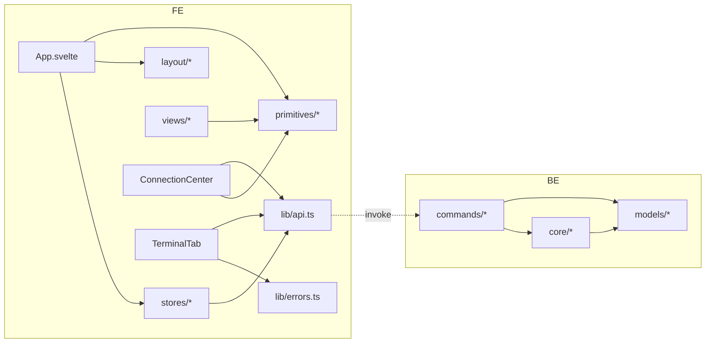

# TermForge 开发架构 — 模块拆分（Module Split）

> 版本：v1.0（2026-09-02，P7 产物）
> 基线：旧仓结构（reverse-analysis §②）+ P4 §四公共能力识别归位 + C-1 规划模块预留。
> 原则：已验证的分层不动（commands 薄 → core 业务 → models DTO）；公共能力单源化；规划模块给**预留位置**不建空壳代码。

---

## 1. 目标结构（新仓）

```text
termforge/
├── src-ui/                              # 前端（Svelte 4 + TS）
│   └── src/
│       ├── main.ts                      # 入口（保留）
│       ├── app.css                      # 设计令牌（DS TOKEN.md 单源；+radius 专用令牌）
│       ├── App.svelte                   # 外壳编排（读 stores，不再自持状态）
│       ├── stores/                      # 【V1 拆分】docs/04_architecture/STATE_MACHINE.md §3
│       │   ├── session.ts               #   tabs/activeTabId/五态迁移动作
│       │   ├── connections.ts           #   已存连接镜像 + 查重
│       │   ├── ui.ts                    #   视图/折叠/宽度/字号/面板开关
│       │   └── (toast 沿用 lib/toast.ts)
│       ├── lib/
│       │   ├── api.ts                   # invoke 封装（10 命令 + AppEvent 只登记已实现项）
│       │   ├── toast.ts                 # 通知 pub/sub（保留原样）
│       │   ├── icons.ts                 # 内联 SVG 单源（DS ASSETS.md）
│       │   └── errors.ts                # 【V1 新增】错误码→friendlyError 映射单源（7 条，含 B-13）
│       ├── components/
│       │   ├── ConnectionCenter/        # 【V1 重组】连接中心（原 ConnectionForm 拆分）
│       │   │   ├── index.svelte         #   编排：列表 + 表单
│       │   │   ├── HostCard.svelte      #   B-01/B-07 主机卡
│       │   │   └── AuthForm.svelte      #   认证表单（B-09 辅助说明）
│       │   ├── TerminalTab.svelte       # 终端（B-04/B-05/B-08 文案与重连条修正）
│       │   ├── layout/                  # ActivityBar / SidePanel / TabStrip / StatusBar（保留）
│       │   └── primitives/              # DS COMPONENT.md §9 全量登记
│       │       ├── ToastContainer.svelte
│       │       ├── EmptyState.svelte    #   +引导式变体（B-02：action 插槽）
│       │       ├── CommandPalette.svelte#   占位引导化（B-03）
│       │       ├── DangerConfirm.svelte #   【V1 新增】B-06
│       │       ├── KeyFingerprintConfirm.svelte # 【V1 新增】B-12
│       │       └── StatusDot.svelte     #   【V1 抽取】五态徽标单源（消除 TabStrip/StatusBar 双定义）
│       └── views/                       # 【V1 新增目录】占位视图的引导式空态
│           ├── SftpPlaceholder.svelte   #   F029/F038（内容=B-02，逻辑空）
│           ├── TunnelPlaceholder.svelte #   F030/F039
│           ├── RunbookPlaceholder.svelte#   F031/F040
│           └── SettingsPlaceholder.svelte#  F032/F034（B-10 指向字号入口）
├── src-tauri/                           # 后端（Rust，分层保留）
│   └── src/
│       ├── lib.rs                       # Builder + 命令注册（10 命令）
│       ├── commands/                    # 薄命令层（参数校验 + core 转发 + 错误归类）
│       │   ├── session.rs               #   session_*（+host_key_check/trust）
│       │   └── store.rs                 #   connection_*
│       ├── core/
│       │   ├── session_manager.rs       # 会话表（close 修复语义：先移除后关闭、幂等）
│       │   ├── crypto.rs                # AES-256-GCM（失败=错误，不再降级明文）
│       │   └── ssh/
│       │       ├── client.rs            # SSHSession + IO 线程（保留）
│       │       └── known_hosts.rs       # 【V1 拆出】TOFU 读写/匹配（原 client.rs 内联函数）
│       └── models/
│           ├── dto.rs                   # 请求/响应（Debug 脱敏保留）
│           └── events.rs                # AppEvent（只登记已实现）
├── docs/                                # 本套文档（product/architecture/review）
├── docs/07_design_system/                       # DS 五文件（TOKEN/COMPONENT/PATTERN/ASSETS/GUIDELINES）
└── prototype/
    ├── v0-old/                          # 旧项目事实基线原型（只读）
    └── v1-new/                          # V1 新版原型（B 类优化落地）
```

## 2. 公共能力归位表（P4 §四 → 模块）

| 公共能力 | 旧仓散落处 | 新仓归位 |
|---|---|---|
| 五态→颜色/文案映射 | TabStrip + StatusBar 两处重复 | `primitives/StatusDot.svelte` 单源 |
| friendlyError 映射 | TerminalTab 内联 6 分支 | `lib/errors.ts`（7 分支含 B-13）单源，供终端/Toast 复用 |
| 危险确认 | 原生 confirm() | `primitives/DangerConfirm.svelte`（docs/07_design_system/PATTERN.md §2） |
| TOFU 逻辑 | client.rs 内联 3 函数 | `core/ssh/known_hosts.rs`（查询/匹配/记录分离，支撑 host_key_check/trust） |
| 设计令牌 | app.css（圆角借用间距） | app.css 全量令牌 + radius 专用（docs/07_design_system/TOKEN.md §4） |
| 图标 | icons.ts 6 枚 | icons.ts 扩至 14 枚（docs/07_design_system/ASSETS.md §2，仍单文件内联） |
| Toast 时序 | toast.ts | 原样保留 |
| 连接列表渲染 | ConnectionForm 内联 | ConnectionCenter/HostCard |
| 事件订阅+过滤 | TerminalTab 内联回调 | 保留在 TerminalTab（会话强绑定，不抽象） |

## 3. 规划模块预留位置（不建空壳，仅留目录与接入点）

| 规划功能（C-1） | 预留位置 | 接入点（已存在） | 依赖的契约 |
|---|---|---|---|
| SFTP（F029/F038） | `views/SftpView.svelte`（替换 Placeholder）+ 后端 `commands/sftp.rs` + `core/sftp/mod.rs`（复用 SessionManager 会话） | 活动栏 SFTP 图标、引导式空态按钮 | sftp:progress 事件 + sftp_list/upload/download 命令 |
| 隧道（F030/F039） | `views/TunnelView.svelte` + `core/tunnel/`（基于现有 SSHSession 扩 channel_direct_tcpip） | 活动栏 Tunnel | tunnel 命令组 |
| Runbook（F031/F040） | `views/RunbookView.svelte` + `core/runbook/`（执行记录落 `~/.termforge/runs/`，data-model §3.1） | 活动栏 Runbook | runbook:progress 事件 |
| 设置持久化（F032/F034） | `views/SettingsView.svelte` + `commands/settings.rs`（settings.json） | 活动栏 Settings + uiStore 持久化钩子 | settings_get/set |
| 命令面板命令集（F033） | `CommandPalette.svelte` 内容层 + `lib/commands-registry.ts` | Ctrl+Shift+P 壳 | session_list（F028）等只读命令 |
| 编辑连接（F035） | ConnectionCenter/AuthForm 增加 edit 态（后端 upsert 已支持） | HostCard 编辑入口 | connection_save（现状即可） |
| 密钥认证 UI（F045） | AuthForm + key_path 字段/选择器 | 密码辅助说明位置 | session_open.key_path（现状即可） |
| 自动重连（F037） | TerminalTab 重连策略层（reconnecting 状态） | Reconnect 条 | terminal:status 扩 "reconnecting" |
| Keychain（F041）/明文密码治理（C-8） | `core/crypto.rs` 后端 Provider 接口化 | connection_save/list | — |
| 复制粘贴（F044） | TerminalTab xterm selection/clipboard | 终端区 | Tauri clipboard 插件（新增依赖需确认） |
| 危险命令确认（F042） | session_send 前端拦截层 | 终端输入链路 | — |
| 监控（F043） | `views/` + monitor:snapshot | — | — |
| 更新通知（F046） | `lib/updater.ts` | Toast | Tauri updater 插件（需确认） |

## 4. 依赖规则（模块边界）



- 前端：组件不直接 invoke（一律经 lib/api.ts）；primitives 不读 stores（纯展示 + 事件上抛）。
- 后端：commands 不含业务逻辑（校验+转发+错误归类）；core 不 import tauri 命令宏（AppHandle 事件发射除外，现状 client.rs 依赖 AppHandle——保留为已知耦合，记录不扩大）。
- models 只放 DTO/事件，无逻辑。

## 5. 变更域与发布节奏建议

| 变更域 | 涉及文件（前后端对称） | 备注 |
|---|---|---|
| 连接字段变更 | store.rs SavedConnection + api.ts SavedConnection + AuthForm | 双定义必须同一 PR |
| 新增事件 | events.rs + api.ts AppEvent + 消费组件 | 禁单侧 |
| 五态扩展（如 reconnecting） | StatusDot + state-management 映射表 + TerminalTab | DS 同步更新 |
| 令牌变更 | app.css + docs/07_design_system/TOKEN.md | 先文档后代码 |

## 6. 迁移对照（旧仓 → 新仓）

| 旧仓文件 | 去向 |
|---|---|
| App.svelte（状态内联） | App.svelte（编排）+ stores/session|connections|ui |
| ConnectionForm.svelte | components/ConnectionCenter/{index,HostCard,AuthForm} |
| TerminalTab.svelte | 同名保留（文案/重连条/errors.ts 抽出） |
| TabStrip/StatusBar 的状态映射 | primitives/StatusDot.svelte |
| SidePanel 内联 EmptyState 分支 | views/*Placeholder.svelte（SidePanel 只做容器） |
| client.rs 的 known_hosts 函数 | core/ssh/known_hosts.rs |
| store.rs 明文降级分支 | 删除（E_ENCRYPT_FAILED） |
| _bmad-output/、.claude/ | 不迁移（过程资产，留存旧仓） |
| docs/（VitePress） | 新仓重建，收录本套 docs |
