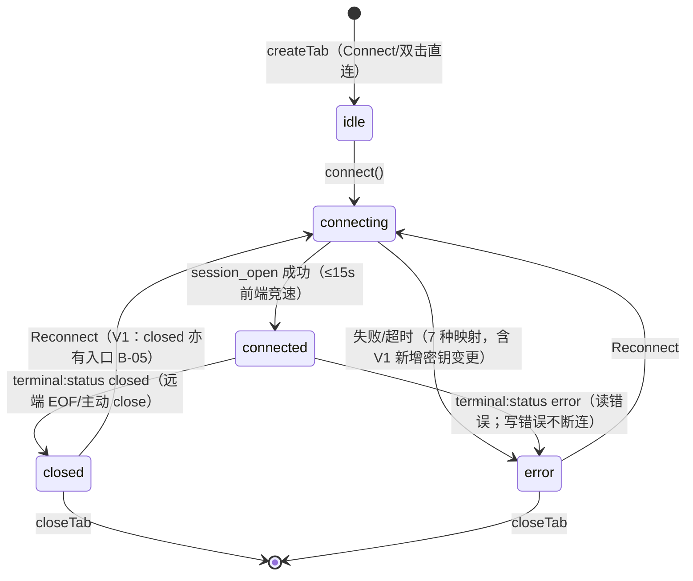

# TermForge 开发架构 — 状态管理（State Management）

> 版本：v1.0（2026-09-02，P7 产物）
> 对齐：逆向报告（App.svelte / TerminalTab.svelte / types.ts / toast.ts）+ P4 审查 + DS PATTERN.md §1。

---

## 1. 状态全景与归属

| 状态域 | 归属（现状源码） | V1 归属（stores 划分） | 持久化 |
|---|---|---|---|
| 会话五态状态机 | TerminalTab 组件内 `status` + App 的 tab.status 双份 | **sessionStore（核心）** | 否 |
| Tab 集合 | App.svelte `tabs/activeTabId/tabCounter` | sessionStore | 否 |
| 已存连接 | App.svelte `savedConnections` | connectionStore | 后端 connections.json |
| 表单状态 | ConnectionForm 内（host/port/username/password/errors/touched/submitting/selectedConnId） | 保留组件内（表单局部态，不上提） | 否 |
| 外壳 UI | App.svelte `activeView/sidePanelCollapsed/terminalFontSize/showCommandPalette` | uiStore | 否（F034 规划：fontSize/侧栏宽/视图持久化） |
| 通知 | lib/toast.ts（模块级 pub/sub） | toastStore（保持现状模式） | 否 |
| 后端会话表 | SessionManager HashMap | 后端唯一事实源，前端经 session_list 只读镜像（F028 接入后） | 否 |

**划分原则**：跨组件读写→store；单组件局部→组件内；后端权威状态→前端只镜像不复制决策（sessionId 以 App.tabs 为准的现状保留，但重连换 id 由 TerminalTab 派发 connected 事件回写——事件流向保持单向：TerminalTab → App）。

## 2. 五态状态机（核心）

### 2.1 定义（来源 `lib/types.ts`：`TabStatus = 'idle'|'connecting'|'connected'|'closed'|'error'`）



### 2.2 状态机归属与不变式

- **单一写入者**：状态迁移只能由 TerminalTab 的 `setStatus()` 发起（组件内 status 为事实源），经 `statuschange` 事件同步到 App.tabs[].status（TabStrip 状态点与 StatusBar 消费）。App 不直接改 tab.status——保持现状（App.svelte handleTabStatusChange 仅被动写入）。
- **后端事件是 closed/error 的唯一触发源**：`terminal:status` 事件按 session_id 过滤后驱动迁移（TerminalTab L127-134）；连接期的成功/失败由 session_open 的 Promise 结果驱动。
- **重连换新 session_id**：Reconnect 重新走 connect()，旧 unlisten 取消、新 id 回填（connected 事件携带 sessionId+tabId）。
- **竞态守卫**：connect() 开头 `if (unlisten) unlisten()`（TerminalTab L117）防事件串扰——保留；deferred-work 提到的并发 connect 串扰风险仍标记【已知边界】。
- **closed 与 error 的语义边界**：远端正常关闭=closed（可重连）；协议/IO 失败=error（写错误特殊：报 error 事件但连接保持，状态置 error 是现状行为——保留并记录）。

### 2.3 状态的派生视图（只读消费，禁止复制映射）

| 消费者 | 派生 | 来源 |
|---|---|---|
| TabStrip 状态点 | 颜色/形态/脉冲 | statusColors/statusFilled（两处重复定义→V1 抽 StatusDot 单源） |
| StatusBar | 五态标签文案 + `Connected to {title}` | statusLabels |
| 终端内呈现 | Connecting.../清屏/`[status]`/`[error]` 行 | connect() 与事件回调 |
| Reconnect 条 | error **或 closed**（V1 修复：源码仅 error） | TerminalTab L188 |

## 3. stores 设计（V1 划分）

### 3.1 sessionStore（新建，收敛 App.svelte 内联状态）

```ts
// stores/session.ts —— 会话与 Tab 集合（窗口级）
interface TabState {
  id: string; title: string;
  connection: ConnSnapshot;      // host/port/username/password?（创建时快照）
  sessionId: string | null;
  status: TabStatus;
}
// 可写 state: tabs, activeTabId
// 派生: activeTab（reactive）
// actions: createTab(conn) → string, closeTab(id), activateTab(id),
//          switchTab(dir), gotoTab(n), renameTab(id,title),
//          bindSession(tabId, sessionId), setStatus(tabId, status)
// 不变式: closeTab 总是激活相邻 Tab（prevIndex 钳制，App.svelte L187-193 现状保留）
```

### 3.2 connectionStore（新建）

```ts
// stores/connections.ts —— 已存连接镜像
// state: savedConnections: SavedConnection[]
// actions: load()（connection_list，失败静默+Empty 列表，现状基线），
//          save(conn)（查重→connection_save→刷新）, remove(id)
// 查重规则保持前端先行：name 或 host+port+username（ConnectionForm L67-74）
```

### 3.3 uiStore（新建）

```ts
// stores/ui.ts —— 外壳 UI 态
// state: activeView(5 值枚举), sidePanelCollapsed, panelWidth(180-400),
//        fontSize(默认13，菜单档 10-20，保护 6-32), paletteOpen
// 不变式: 活动栏点击当前视图=折叠切换；异视图=切换+展开（App.svelte L254-264）
// 规划 F034: 持久化 fontSize/panelWidth/activeView 至后端 settings
```

### 3.4 toastStore（现状保留）

- 现有 `lib/toast.ts` 模块级 pub/sub + 订阅者集合——**原样保留**（经 V0/V1 双原型验证的行为：3s→leaving→250ms 移除、点击即关、column-reverse 栈）。

## 4. 事件 → 状态 的映射总表

| 触发 | 通道 | 状态变化 | 副作用 |
|---|---|---|---|
| Connect/双击 | 用户操作 | 新 Tab=idle→connecting | 终端 "Connecting..."、黄点脉冲 |
| session_open resolve | invoke 返回 | →connected | 清屏、sessionId 回填、初始 doFit+resize |
| session_open reject/15s | invoke/超时 | →error | 红字 `[error]` 7 种映射 + 重试指引（B-04 文案） |
| terminal:data | app_event | 无状态变化 | xterm.write(chunk) |
| terminal:status closed | app_event | →closed | `[status] closed` 行；V1: Reconnect 条 + 断线 Toast（B-05/B-11） |
| terminal:status error | app_event | →error | `[status] error: Read/Write error` |
| Reconnect 点击 | 用户操作 | closed/error→connecting | 重新订阅+session_open（凭据用 Tab 快照） |
| Ctrl+W / × | 用户操作 | Tab 移除 | session_close（修复后契约：后端保证回收） |

## 5. 已知边界与守卫清单（重开发实现时逐条核对）

1. 快捷键在 input/textarea/.xterm 聚焦时全部让位（App.svelte L67-69）——保留（SSH 透传惯例）。
2. Escape 优先级：palette > 确认框 > 指纹框(V1) > 行内重命名 > 字号菜单；终端聚焦不拦截。
3. 15s 连接超时为前端 Promise.race；后端 TCP read timeout 30s——两层超时并存，错误文案统一映射 "Connection timed out"。
4. `terminalFontSize` 变化 → TerminalTab 响应式 `terminal.options.fontSize` + doFit + session_resize（F017/F018 链路）。
5. 侧栏宽度拖拽中禁用 CSS 过渡（SidePanel .dragging）——保留。
