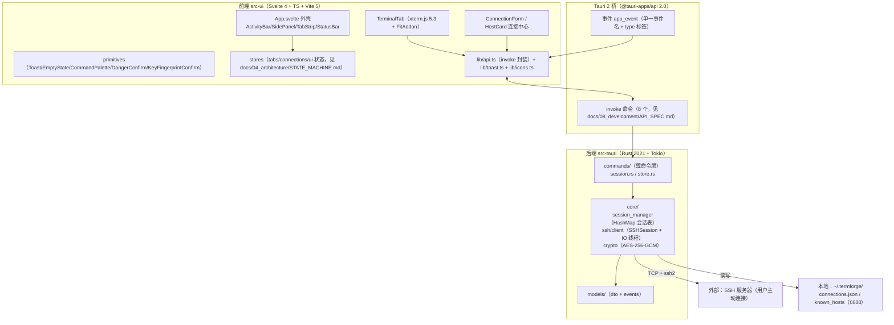

# TermForge 开发架构 — 技术架构（Tech Architecture）

> 版本：v1.0（2026-09-02，P7 产物）
> 依据：逆向报告（docs/01_reverse/REVERSE_ANALYSIS.md）+ PRD + P4 审查 + Design System。
> 结论先行：**默认延续 Tauri 2 + Svelte 4 + Rust(ssh2) 技术栈重开新仓**，理由见 §2；重大调整项以【建议，待用户确认】标注。

---

## 1. 总体架构（Mermaid）

**事件流**（现状基线，保留）：后端 `app.emit("app_event", AppEvent)`，payload 为 `#[serde(tag="type")]` 标签枚举（terminal:data / terminal:status）；前端 `getCurrentWindow().listen` 订阅后按 `session_id` 过滤分发（TerminalTab L122-134）。

**IO 模型**（现状基线，保留）：每会话一条专用 OS 线程独占 ssh2 Channel——非阻塞读（5ms 轮询）+ mpsc 命令通道（Write/Resize/Close），写时短暂切回阻塞（client.rs L96-326）。

## 2. 技术选型与理由

| 层 | 选择 | 理由 | 备选与代价 |
|---|---|---|---|
| 桌面壳 | **延续 Tauri 2** | ① 旧项目 CSP/capabilities/窗口配置已验证可用；② 产物体积小、无捆绑浏览器；③ 前后端契约（invoke/event）成熟；④ 无遥测依赖符合产品定位 | Electron（体积大、内存高，无收益）；Flutter Desktop（需重写全部 UI 与 SSH 层，成本高）|
| 前端框架 | **延续 Svelte 4** | ① 16 个组件规模下 Svelte 简洁性最优；② xterm.js 集成模式已在 TerminalTab 验证（动态 import + dispose 清理）；③ 事件流到 store 的响应式链路已跑通 | Svelte 5（runes）【建议，待用户确认：新仓可直接上 Svelte 5，但需重写响应式语法；保守则 4.x 起步】；React/Vue（重写成本高，无对应收益）|
| 终端渲染 | **延续 xterm.js 5.3 + fit addon** | 行业事实标准；PTY 主题从 CSS 令牌读取的方案已实现 | 自绘 canvas（成本极高）|
| SSH 协议 | **延续 Rust ssh2 0.9（libssh2）** | ① 真实链路（握手/认证/TOFU/PTY/IO 线程）已全部跑通；② 阻塞模型与专用 IO 线程配合简单可靠 | russh（纯 Rust 异步）【建议，待用户确认：若规划隧道/SOCKS5（F039）与长连接池，russh 的异步模型更契合；但意味着重写全部 SSH 层，MVP 阶段不建议】|
| 异步运行时 | **延续 Tokio（rt-multi-thread）** | spawn_blocking 包裹阻塞连接的模式已验证；mpsc+线程与 tokio 互不冲突 | — |
| 加密 | **延续 aes-gcm + sha2 机器绑定** | 单元测试覆盖；0600 落盘已实现 | keyring-rs（OS Keychain，F041 规划，属 C-8 决策）|
| 状态管理 | **Svelte stores（见 docs/04_architecture/STATE_MACHINE.md）** | 现有 toast.ts 的 pub/sub 模式已验证，无需引入框架 | Pinia/Redux 类（不适用）|
| 构建 | **延续 Vite 5 + vite-plugin-svelte** | 配置就绪 | — |

**明确不做**：前端路由库（单窗口五视图，activeView 字符串切换足够，基线如此）；UI 组件库（Tokyo Night DS 自持，组件已入库 docs/07_design_system/）；网络遥测/更新检查（F046 规划，未决策前不做）。

## 3. 关键质量决策（承接 P4）

| 决策点 | 本架构的立场 | 来源 |
|---|---|---|
| 加密失败 | **拒绝保存并向前端报错，永不明文落盘**（修复后规格，docs/08_development/API_SPEC.md 写入错误码） | C-7 |
| session_close 语义 | **幂等 + 保证回收**：无论通道关闭成败，SessionManager 必移除句柄；对不存在 id 返回 Ok（幂等） | C-6 |
| TOFU | 前端确认式（KeyFingerprintConfirm）+ 后端 `host_key_check` 命令（首连返回指纹待确认，确认后记录）；MITM 专案错误码 | B-12/B-13 |
| 事件系统 | 保留单一 `app_event` + type 标签；**新增事件必须先登记 events.rs 枚举与 api.ts 联合类型**（旧项目 api.ts 预留 3 种未实现事件属规划残留，新仓禁止无后端的类型） | reverse-analysis ② |
| 密码内存面 | invoke 返回仍含解密密码（基线）；Keychain 化属 C-8，未决策前保持并在 DTO 注释标注风险 | C-8 |

## 4. 部署与运行

- 窗口：1200×800（min 800×500），单主窗口（tauri.conf.json）。
- CSP：`default-src 'self'; script-src 'self'; style-src 'self' 'unsafe-inline'; font-src 'self' data:; img-src 'self' data:;`——保留（零外链铁律的技术约束源）。
- capabilities：`core:default` + event listen/emit + window start-dragging + shell:allow-open——保留。
- 数据目录：`~/.termforge/`（自建；connections.json / known_hosts，Unix 0600）。
- 日志：tracing + tracing-subscriber（env-filter，默认 info）——保留。
- 【建议，待用户确认】日志落盘与轮转（现状仅 stdout，排障困难；tracing-appender 成本低）。

## 5. 风险与已知边界

1. **浏览器保留组合键**（Ctrl+Tab/Ctrl+W）在 Tauri WebView 的拦截效果【未知——旧项目未实测】；建议新仓落地时以 Tauri 菜单加速键兜底（C-5）。
2. ssh2 阻塞模型下的连接取消（connecting 中止）成本高——MVP 不做（D-5）。
3. 每 IO 线程 5ms 轮询在会话量大（>50）时的 CPU 占用【未知——未压测】；规划监控面板（F043）时再评估。
4. 机器绑定密钥的跨机迁移缺失（换机即失密）——已知取舍，Keychain 属 C-8。
