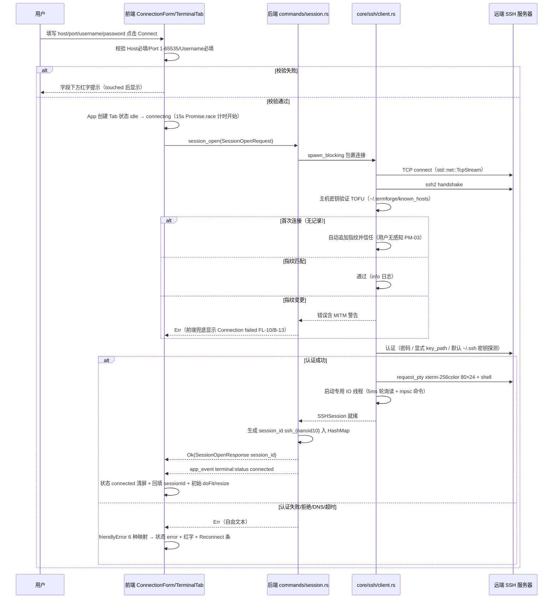
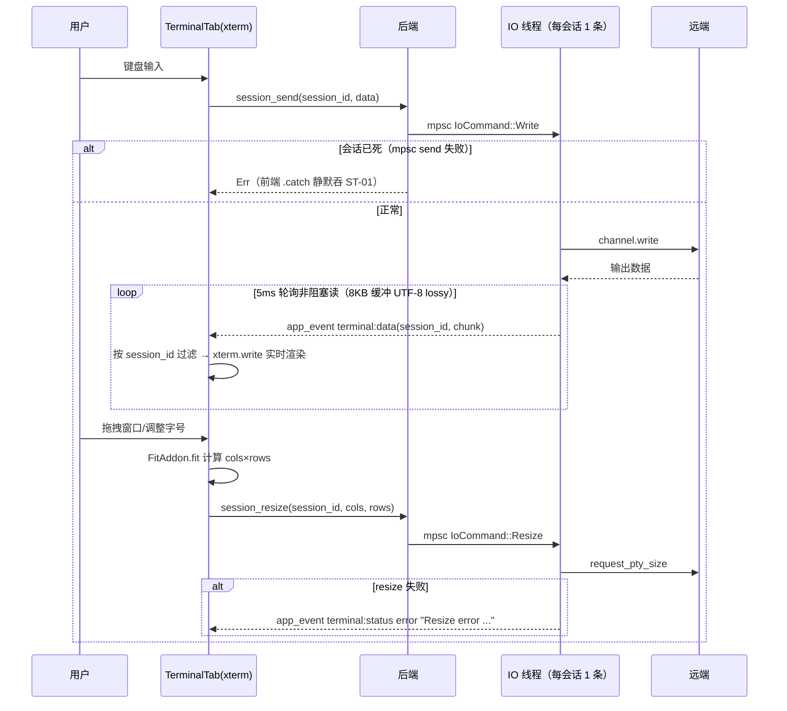
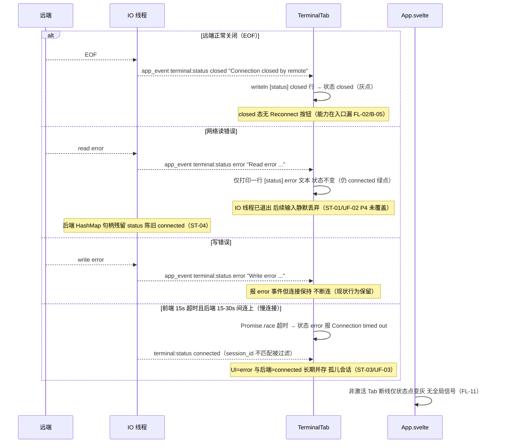
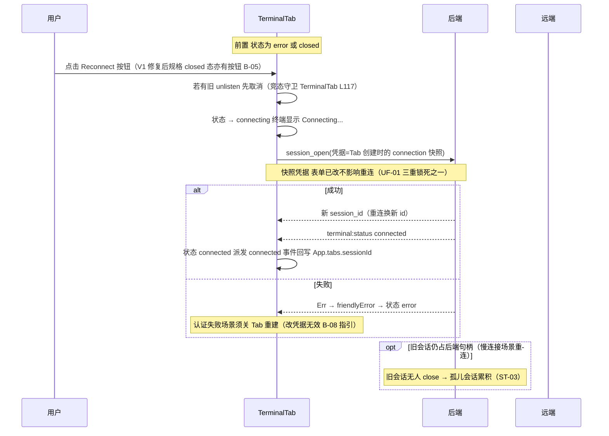
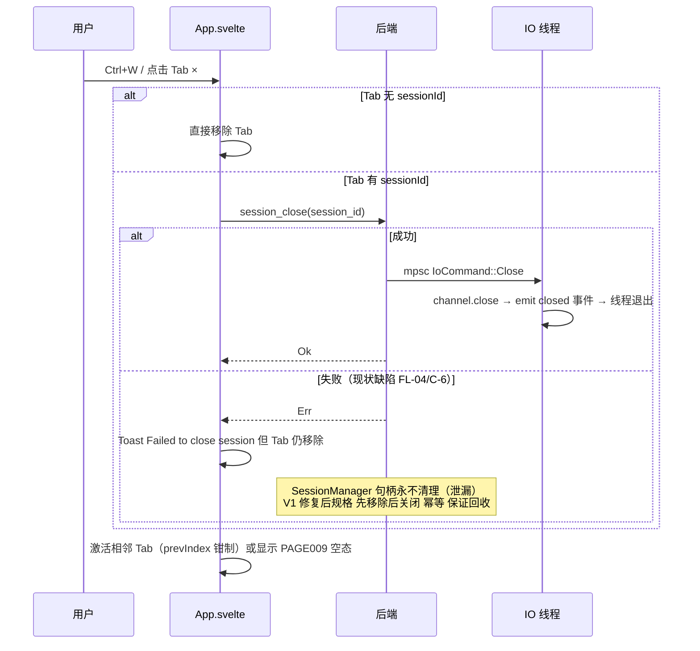

# TermForge 时序图集（SEQUENCE DIAGRAMS）

> 版本：v1.0（2026-09-03，按《旧 App AI 重构 SOP v2.0》P8 产物补齐）
> 内容来源：交互步骤取自 `docs/08_development/API_SPEC.md` §2/§4（P7 契约）、`docs/01_reverse/REVERSE_ANALYSIS.md` §②④、`docs/04_architecture/STATE_MACHINE.md` §2/§4；缺陷行为（超时分裂/静默吞错等）如实标注并给出处编号（ST/DS/UF，见 docs/product-review/ 各分册）。现状行为与 V1 修复后规格在图中以 Note 区分。

---

## 时序 1：新建连接 + 认证（session_open 全链路）

现状（自动 TOFU）；V1 建议为确认式 TOFU（host_key_check/host_key_trust 两命令为 V1 新增规格，随 B-12 决策，尚未实现）。

（步骤来源：API_SPEC §2.1、REVERSE_ANALYSIS §④ PAGE003、client.rs 认证三分支 L135-186。）

## 时序 2：会话建立后的输入输出循环

（步骤来源：REVERSE_ANALYSIS §② IO 模型、API_SPEC §2.2/§2.5；send 失败静默 catch 为 TerminalTab L84 事实，ST-01。）

## 时序 3：断线与错误路径

（步骤来源：REVERSE_ANALYSIS §⑥ 流程 3、STATE_MACHINE.md §1.1/§1.3 双轨对照表、client.rs L216-289 事件触发点。）

## 时序 4：手动重连（Reconnect）

（步骤来源：STATE_MACHINE.md §2.2 单一写入者/重连换 id/竞态守卫、USER_FLOW_REVIEW.md F3/UF-01。）

## 时序 5：凭据存取加解密（Save / list / 换机失效）

```mermaid
sequenceDiagram
    participant U as 用户
    participant FE as ConnectionForm
    participant ST as commands/store.rs
    participant CR as core/crypto.rs
    participant FS as ~/.termforge/connections.json

    rect rgb(30,30,46)
    Note over U,FS: 保存路径（Save）
    U->>FE: 填表点 Save
    FE->>FE: 校验 + 查重（name 或 host+port+username）
    alt 查重命中
        FE-->>U: Toast already exists（不写入）
    else 通过
        FE->>ST: connection_save(SavedConnection)
        ST->>CR: encrypt(password)
        CR->>CR: key = SHA-256("TermForge-v1:{hostname}:{username}")
        CR->>CR: base64(nonce12 ‖ ciphertext ‖ tag16)
        alt 加密失败（触发条件近死 DS-02）
            ST->>FS: 明文落盘（warn 降级 缺陷 V1 改为拒绝保存 E_ENCRYPT_FAILED）
        else 成功
            ST->>FS: pretty JSON 写入（0600）按 id upsert
            ST-->>FE: Ok
            FE-->>U: Toast saved + 刷新列表
        end
    end
    end

    rect rgb(30,30,46)
    Note over U,FS: 读取路径（应用启动 / 保存删除后刷新）
    FE->>ST: connection_list
    ST->>FS: 读取 JSON（损坏则空列表兜底）
    loop 每条记录
        ST->>CR: decrypt(password)
        alt 解密成功（本机 hostname+username 未变）
            CR-->>ST: 明文密码
        else 解密失败（换机/改用户名/改主机名）
            ST->>ST: warn 后置 password=None（静默 DS-01）
            Note over ST: 前端表现为该连接无密码 无任何提示
        end
    end
    ST-->>FE: Vec<SavedConnection>（password 为解密明文 DS-03）
    FE->>FE: App.savedConnections 镜像 选择连接回填表单
    end
```

（步骤来源：API_SPEC §2.6-2.7、DATA_MODEL.md §2.1/§2.6、DATA_STORAGE_REVIEW.md §2.1-2.3；加密参数出处 crypto.rs。）

## 时序 6：关闭会话（session_close）

（步骤来源：API_SPEC §2.3 现状缺陷与 V1 契约、REVERSE_ANALYSIS §⑥ 流程 3、App.svelte L177-194。）

## 时序总览与状态机对应

| 时序 | 对应状态迁移（STATE_MACHINE.md §2.1） | 备注 |
|---|---|---|
| 1 新建连接+认证 | idle → connecting → connected / error | 15s 前端竞速 + TCP 30s 后端超时双层 |
| 2 输入输出循环 | connected 保持 | terminal:data 无状态变化 |
| 3 断线/错误 | connected → closed（仅此一条运行时事件路径）；error 事件**不迁移**（ST-01 缺口） | api.ts 类型联合不含 error |
| 4 重连 | closed/error → connecting → connected/error | 换新 session_id |
| 5 凭据加解密 | 不涉及 Tab 状态 | 后端文件读写 |
| 6 关闭会话 | closed/error → [*]（closeTab） | 幂等修复为 V1 规格 |
