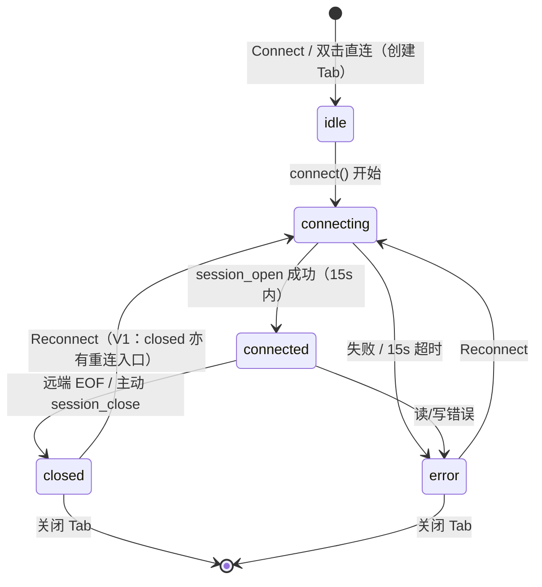

# TermForge Design System — 交互模式（Patterns）

> 版本：v1.0（2026-09-02，P5 产物）
> 来源：旧项目源码行为基线（注明文件）+ P4 审查 B 类优化规格（注明「V1 修复后规格」）。

---

## 1. 连接-会话-中断流转（核心生命周期模式）

**状态机**（来源 `lib/types.ts` + TerminalTab.svelte；归属与 stores 划分见 P7 docs/04_architecture/STATE_MACHINE.md）：



**流转中的 UI 同步点**（三处联动，来源 App/TabStrip/StatusBar）：

| 事件 | Tab 状态点 | 状态栏 | 终端内 | 其他 |
|---|---|---|---|---|
| Connect 发起 | 黄点脉冲 | "Connecting... to user@host" | 清屏 + "Connecting..." | 侧栏表单不清空 |
| 连接成功 | 绿点实心 | "Connected to user@host" | 清屏进入 shell | 首次连接前触发 TOFU 确认（V1，B-12） |
| 连接失败 | 红点实心 | "Error to user@host" | 红字 `[error] 友好文案` + 重试指引（V1：无 Ctrl+R 死文案） | Reconnect 条（V1 修复后规格） |
| 远端断开 | 灰点空心 | "Disconnected to user@host" | `[status] closed: Connection closed by remote` | **V1**：Reconnect 条 + 非激活 Tab 断线 Toast（B-05） |
| 关闭 Tab | 移除 | 切相邻 Tab 或 "No active session" | — | session_close（修复后规格：失败仍保证后端回收，C-6） |

**错误映射模式**（friendlyError，来源 TerminalTab L105-113；V1 增第七条）：

| 原始错误包含 | 呈现 | V1 追加指引 |
|---|---|---|
| Connection refused | Connection refused — check host and port | — |
| Authentication | Authentication failed — check username and password | 如已修改凭据，请关闭此 Tab 重新连接（B-08） |
| timed out / timeout | Connection timed out | — |
| Name or service not known | Host not found — check the address | — |
| Network is unreachable | Network unreachable | — |
| Host key mismatch（**V1 新增**，B-13） | 主机密钥变更 — 可能存在中间人攻击 | 如确认服务器重装/换密钥，删除 known_hosts 对应条目后重试 |
| 其他 | Connection failed | — |

## 2. 危险确认模式（DangerConfirm）

- **适用**：不可撤销的破坏性操作。旧项目仅「删除已保存连接」一处（原生 confirm，F-05）；V1 统一为自绘对话框（B-06）。
- **规格**：
  - 遮罩 `--overlay-backdrop`；面板 `--bg-secondary` + `--border` + 8px 圆角 + `--shadow-modal`；宽约 360-420px 居中。
  - 文案三段式：动作说明（「删除连接 "name"？」）+ 后果说明 + 明确按钮。
  - 按钮：取消（secondary，Esc 等价）在左；确认（**危险色**：`--error` 语义描边或底色，文案为具体动词如「删除」）在右。
  - 焦点默认在取消按钮（防误回车）。
- **不变式**：确认前不发生任何数据变更；取消 = 无操作。

## 3. 快捷键交互模式

- **来源**：App.svelte handleKeydown（9 组全表见 docs/07_design_system/TOKEN.md §8.3）。
- **作用域规则**：焦点在 HTMLInputElement / HTMLTextAreaElement / `.xterm` 时全部快捷键让位（透传给远端 shell 或输入法）——SSH 客户端透传惯例（product-review F-07，D 类基线）。
- **键盘导航**：Tab 页签 role=tab + tabindex=0 + Enter/Space 选中；已存连接列表 role=button + Enter 回填。
- **Esc 语义优先级**（V0/V1 原型实现顺序）：命令面板 > 确认对话框 > 行内重命名 > 字号菜单。终端聚焦时 Esc 不拦截。
- **防误触**：Ctrl/Cmd 判定要求无 Alt；数字键 1-9 钳制到 Tab 数。

## 4. 空态模式（EmptyState 及引导式变体）

**基础形态**（来源 `primitives/EmptyState.svelte`）：icon(32px,50%) + text(`--text-sm`) + hint(`--text-xs`,70%)，垂直居中。

**V1 引导式空态**（B-02，product-review P-01）：在基础形态上追加「行动区」，用于占位视图与引导页：

```
[icon]
主文案（现状）
说明（为什么空 / 前置条件）
[主行动按钮]  [次行动]        ← 新增
辅助说明（规划能力 → C 类决策清单标注，不虚构）
```

| 场景 | 主文案 | 行动 |
|---|---|---|
| SFTP/Tunnel/Runbook 视图（无连接） | 保持旧文案事实（如 "No active SFTP session"） | 「前往连接中心」按钮（切 connections 视图）+ 「该能力为规划项」标注 |
| Settings 视图 | "Settings" | 引导至状态栏字号菜单（现有真实入口，B-10）+ 规划说明 |
| 终端区无 Tab（PAGE009） | "No active terminals" | 「新建连接」按钮（= Ctrl+T 语义） |
| 连接列表为空 | （不渲染列表） | 表单即空态，聚焦 Host |
| 命令面板占位 | "Command Palette（占位）" | 规划命令类别清单 + C 类标注（B-03） |

**不变式**：引导按钮只指向**已存在**的真实入口或如实标注规划；绝不虚构未实现功能。

## 5. 反馈模式（Toast / 内联 / 终端内三级）

| 级别 | 载体 | 适用 | 来源 |
|---|---|---|---|
| 轻反馈 | Toast（右下，3s） | 保存/删除成功、连接关闭失败、场景提示 | toast.ts |
| 字段级 | 内联红字 | 表单校验错误（失焦后显示） | ConnectionForm |
| 会话级 | 终端内 ANSI 行 | 连接错误（红）、状态变化（`[status]` 行） | TerminalTab |
| 全局级 | 状态栏 | 当前会话五态常显 | StatusBar |

规则：同一事件不重复弹 Toast（保存成功一次）；致命错误 Toast + 终端内行双呈现（如 session_close 失败）；被动事件（远端断开）V1 增加 Toast（B-05）。

## 6. 表单模式（认证表单）

- 失焦标记 touched → 提交校验 → 错误内联显示；提交中（submitting）禁用全部提交按钮防重复。
- 查重在客户端先行（name 或 host+port+username 命中即拦，Toast error），后端按 id upsert。
- Enter = 提交（Connect）；Shift/Ctrl+Enter 不触发。

## 7. 列表选择模式（已存连接）

- 单击选中回填（选中态 `--bg-active`）；双击 = 选中 + 直连（加速操作，头部注明）。
- 删除按钮 hover 显现（键盘可达性以卡片 role=button + Enter 弥补）。
- V1：卡片化（HostCard）+ Connect 快连按钮使核心路径单击可达（B-07）。

## 8. 布局模式（外壳）

- 五区骨架：ActivityBar(48px) | SidePanel(180-400px 可折叠) | [TabStrip(36px) + 内容区 + StatusBar(24px)]（来源 app.css 布局令牌）。
- 侧栏折叠三种触发等价：折叠按钮 / Ctrl+\ / 再次点击活动栏当前视图。
- 浮层层级：内容(1) < 下拉(100) < 命令面板(2000) < Toast(3000)。
- 内容区多 Tab 叠放，仅激活 display:flex（保持 xterm 实例不销毁）。

## 9. 安全交互模式

- **确认式 TOFU**（V1，B-12）：首连 → 模态展示 host:port + 指纹 → 用户确认后才记录 known_hosts 并继续；指纹变更 → 连接失败 + 专案警告文案（B-13）。
- **密码掩码**：输入框 type=password；后端 Debug 输出脱敏（`password=***`，dto.rs/store.rs 手工 Debug）。
- **凭据内存边界**（如实记录）：connection_list 返回解密明文（设计取舍，C-8 留档）。
- **加密失败**（V1 修复后规格，C-7）：保存时加密失败 → 拒绝落盘 + Toast error，**不降级明文**。
