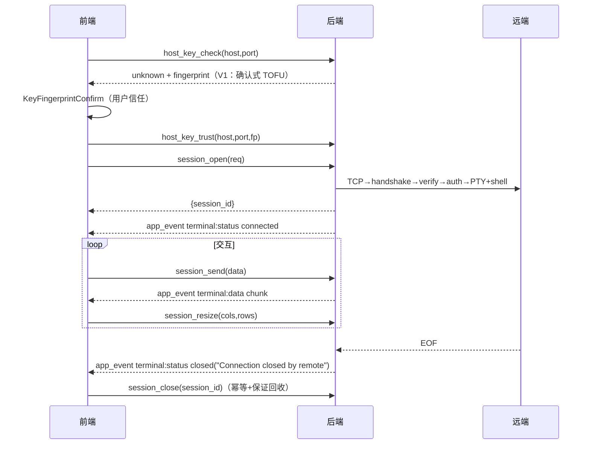

# TermForge 开发架构 — API 设计（Tauri 命令契约）

> 版本：v1.0（2026-09-02，P7 产物）
> 范围：旧项目 8 个已实现命令（逐条契约保真）+ V1 修复语义（session_close 幂等回收、加密失败错误码、host_key_check 确认式 TOFU）+ 规划命令（仅登记，不虚构）。
> 错误码约定：现状后端返回 `Result<T, String>`（错误为自由文本）——V1 契约引入**结构化错误** `{ code: string, message: string }`（【建议，待用户确认】是否在 MVP 落地；下表 code 为 V1 规格）。

---

## 1. 命令总表

| 命令 | 状态 | 文件 | 语义摘要 |
|---|---|---|---|
| session_open | 已实现（V1 扩展前置校验） | commands/session.rs | 打开 SSH 会话 |
| session_send | 已实现 | 同上 | 发送终端输入 |
| session_close | 已实现（**V1 修复语义**） | 同上 | 关闭会话，幂等+保证回收 |
| session_list | 已实现（前端未调用，F028） | 同上 | 列出活动会话 |
| session_resize | 已实现 | 同上 | 同步 PTY 尺寸 |
| connection_list | 已实现 | commands/store.rs | 列出已存连接（密码解密返回） |
| connection_save | 已实现（**V1 修复：加密失败报错**） | 同上 | 保存/更新连接 |
| connection_delete | 已实现 | 同上 | 删除连接 |
| host_key_check | **V1 新增（B-12 确认式 TOFU 前置）** | 建议 commands/session.rs | 查询主机密钥状态/指纹 |
| host_key_trust | **V1 新增** | 同上 | 确认并记录指纹 |

> V1 新增两命令是为支撑 KeyFingerprintConfirm 交互（P4 B-12）；若用户决策保持自动 TOFU，则此两命令不落（属 C 类关联项）。

---

## 2. 逐条契约

### 2.1 session_open

- **入参** `req: SessionOpenRequest`（dto.rs）：

```rust
{ host: String, port: u16, username: String,
  password: Option<String>,          // serde default
  key_path: Option<String> }         // serde default；UI 暂无字段（F045 规划）
```

- **出参**：`SessionOpenResponse { session_id: String }`（`ssh_{nanoid10}`）。
- **行为**：spawn_blocking 包裹 TCP→handshake→host key 验证→认证→PTY(xterm-256color,80×24)+shell→起 IO 线程；成功入表并 emit `terminal:status connected`。
- **错误**（code ← 现状自由文本的归类）：

| code | 触发 | 前端映射（friendlyError） |
|---|---|---|
| E_CONN_REFUSED | TCP 拒绝 | Connection refused — check host and port |
| E_AUTH_FAILED | userauth 失败 / 无密码无可用密钥 | Authentication failed — …（+V1 B-08 指引） |
| E_TIMEOUT | 前端 15s 竞速 / TCP 超时 | Connection timed out |
| E_DNS | Name or service not known | Host not found — check the address |
| E_NET_UNREACHABLE | Network is unreachable | Network unreachable |
| E_HOSTKEY_MISMATCH | 指纹不一致 | **V1 专案**：主机密钥变更 — MITM 警告 + known_hosts 处置指引（B-13） |
| E_CONN_FAILED | 其他（含 Task join error） | Connection failed |

- **脱敏**：Debug 手工输出 `password=***`（dto.rs）——保留。

### 2.2 session_send

- 入参：`{ session_id: String, data: String }`；出参：`()`。
- 错误：`E_SESSION_NOT_FOUND`（"session not found"）／`E_SESSION_CLOSED`（mpsc send 失败 "SSH session closed"）。
- 前端失败静默 catch（TerminalTab L84）——保留。

### 2.3 session_close（V1 修复语义写入契约）

- 入参：`{ session_id: String }`；出参：`()`。
- **现状缺陷**（deferred-work / P4 FL-04）：前端在 invoke 失败时仍移除 Tab，后端句柄永不清理 → 会话泄漏。
- **V1 契约（修复后规格）**：
  1. **先移除后关闭**：`SessionManager.close()` 无条件先 `sessions.remove(&session_id)`，再向 IO 线程发 `IoCommand::Close`（channel.close + wait_close + emit closed）。
  2. **幂等**：session_id 不存在时记 warn 并返回 `Ok(())`（不报错）——重复关闭（Tab 关闭+断线竞态）安全。
  3. **兜底回收**：Close 命令投递失败（IO 线程已退出）时仅记日志——句柄已移除，无线程/连接句柄泄漏（SSHSession Drop 时 Sender 释放，IO 线程 Disconnected 分支自行退出，client.rs L307-312）。
  4. **前端语义不变**：失败仍 Toast 但移除 Tab（App.svelte L182-184）——因后端已保证回收，此行为不再产生泄漏。

### 2.4 session_list

- 入参：无；出参：`Vec<SessionInfo>`（`{session_id, host, username, status}`）。
- 错误：无（恒 Ok）。
- 前端接入点待 C-1（命令面板/状态栏会话总览）。

### 2.5 session_resize

- 入参：`session_id: String, cols: u16, rows: u16`（注意：invoke 侧 camelCase `sessionId`，Tauri 2 自动映射——api.ts L42 现状）。
- 出参：`()`；错误：E_SESSION_NOT_FOUND；resize 失败经 `terminal:status error "Resize error: …"` 事件回报（client.rs L281-289）。

### 2.6 connection_list

- 入参：无；出参：`Vec<SavedConnection>`（**password 为解密明文**——现状取舍，C-8 留档；解密失败→warn+password=None）。
- 错误：无（恒 Ok；文件损坏→空列表兜底，store.rs L48-52）。

### 2.7 connection_save（V1 修复：加密失败）

- 入参：`conn: SavedConnection`（见 docs/08_development/DATA_MODEL.md §2.1）；出参：`()`。
- 行为：按 id upsert → pretty JSON 写 `~/.termforge/connections.json`（0600）。
- **现状缺陷**（P4 FL-05）：加密失败 warn 后**明文落盘**。
- **V1 契约（修复后规格）**：加密失败 → 返回错误 `E_ENCRYPT_FAILED`（message 含"密码加密失败，连接未保存"），**不写盘**；前端 Toast error（V1 原型已按此呈现）。
- 错误：`E_ENCRYPT_FAILED` / `E_IO`（写盘/权限失败）。

### 2.8 connection_delete

- 入参：`id: String`；出参：`()`；行为：retain 过滤后重写文件。
- 错误：`E_IO`。幂等（id 不存在也 Ok）。

### 2.9 host_key_check【V1 新增规格，随 B-12 决策】

- 入参：`{ host: String, port: u16 }`。
- 出参：`{ status: "known" | "unknown" | "mismatch", fingerprint?: String }`（unknown 时返回当前指纹供确认框展示）。
- 错误：`E_CONN_FAILED`（TCP/握手失败——与 session_open 同源）。
- 语义：只读查询，不写 known_hosts。

### 2.10 host_key_trust【V1 新增规格，随 B-12 决策】

- 入参：`{ host: String, port: u16, fingerprint: String }`。
- 出参：`()`；行为：追加写入 known_hosts（0600）。
- 错误：`E_HOSTKEY_MISMATCH`（并发场景下已有不同指纹）／`E_IO`。

---

## 3. 事件契约（app_event）

| type | 载荷 | 触发源 |
|---|---|---|
| terminal:data | {session_id, chunk} | IO 线程读循环（UTF-8 lossy，8KB 缓冲） |
| terminal:status | {session_id, status: "connected"\|"closed"\|"error", msg?} | open 成功 / EOF / 读错误 / 写错误 / resize 错误 / 主动 Close |

**规则**：新增事件必须同时登记 `models/events.rs` 枚举与 `api.ts` AppEvent 联合类型；**禁止前端预留无后端实现的类型**（旧仓 sftp:progress/runbook:progress/monitor:snapshot 三残留为新仓红线）。

**规划事件**（随 C-1 落地时才登记）：sftp:progress{task_id,done,total}、runbook:progress{run_id,host_id,status,tail?}、monitor:snapshot{host_id,ts,cpu,mem,disk,net_in,net_out}、terminal:status 增加 "reconnecting"（F037 自动重连）。

## 4. 序列（关键时序，Mermaid）


