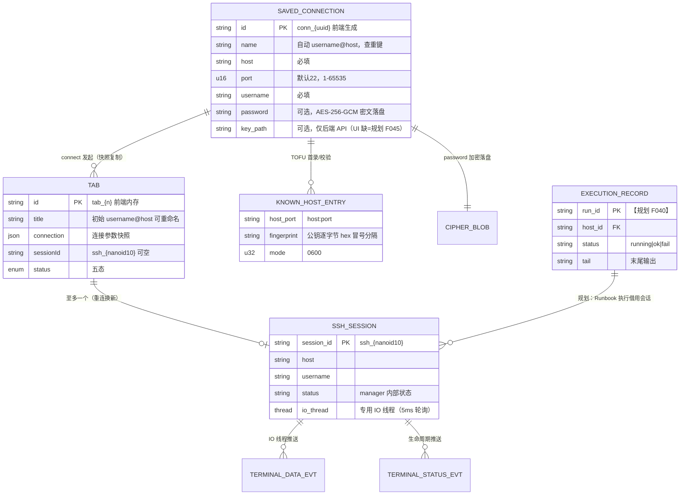

# TermForge 开发架构 — 数据模型（Data Model）

> 版本：v1.0（2026-09-02，P7 产物）
> 对齐：逆向报告 §⑦（前端类型 / 后端 DTO / 持久化实体）+ PRD §5。
> 原则：已实现实体逐字段保真（注明源码来源）；规划实体标注【规划】并给预留结构，不虚构字段语义。

---

## 1. 实体总览（ER，Mermaid）



## 2. 已实现实体（字段级，来源逐条注明）

### 2.1 主机档案 + 凭据：SavedConnection（来源 `commands/store.rs` L10-22，wire 即持久化格式）

| 字段 | 类型 | 约束 | 说明 |
|---|---|---|---|
| id | String | `conn_{crypto.randomUUID()}` 前端生成（ConnectionForm L77） | save 按 id upsert（后端能力，前端编辑入口缺失=F035 规划） |
| name | String | 自动 `username@host`；查重键之一 | |
| host | String | 必填（前端校验） | |
| port | u16 | 1-65535，默认 22 | |
| username | String | 必填 | |
| password | Option\<String\> | `#[serde(default, skip_serializing_if=Option::is_none)]` | 落盘为 base64(AES-256-GCM)；list 时解密返回明文（设计取舍，C-8）；Debug 手工脱敏 `***` |
| key_path | — | **无此字段**（仅 SessionOpenRequest 有） | 规划 F045：若做编辑/密钥 UI，此处加 Option\<String\> |

**持久化**：`~/.termforge/connections.json`，`{ "connections": [SavedConnection...] }`，serde_json pretty，Unix 0600（store.rs persist L139-150）。

### 2.2 会话：SSH 会话句柄（来源 `core/session_manager.rs` L17-24）

| 字段 | 类型 | 说明 |
|---|---|---|
| key | String | session_id = `ssh_{nanoid::nanoid!(10)}` |
| host / username | String | 冗余存储供 session_list |
| status | String | manager 侧固定 "connected"（打开成功才入表） |
| session | SSHSession | 持有 `Mutex<mpsc::Sender<IoCommand>>`（Write/Resize/Close） |

容器：`HashMap<String, SessionHandle>`，`Arc<tokio::sync::Mutex<Inner>>`。**修复后语义（C-6）**：close 时无论 `session.close()`（发 Close 命令）成败，先 `remove` 句柄再尝试关闭——保证不泄漏；对不存在 id 记 warn 并返回 Ok（幂等）。

### 2.3 前端 Tab（来源 `App.svelte` L17-28，内存态不持久化）

| 字段 | 类型 | 说明 |
|---|---|---|
| id | string | `tab_{++counter}` |
| title | string | 初始 `username@host`，双击重命名（F013） |
| connection | {host,port,username,password?} | **创建时快照**——Reconnect 用快照凭据（P4 FL-03 已知边界） |
| sessionId | string\|null | connected 后由 TerminalTab 回填；重连换新 id |
| status | TabStatus 五态 | 见 docs/04_architecture/STATE_MACHINE.md |

### 2.4 已知主机：known_hosts 条目（来源 `core/ssh/client.rs` L39-84）

- 文件：`~/.termforge/known_hosts`，行格式 `{host}:{port} {fingerprint}`，Unix 0600。
- fingerprint = 服务器公钥逐字节 hex 冒号分隔（host_key_fingerprint L23-33）。
- 匹配规则：完全相等→通过；不等→连接失败（错误含 MITM 警告，V1 前端加专案映射 B-13）；无记录→首录信任（V1 升级为确认式 B-12）。

### 2.5 事件载荷（来源 `models/events.rs` + `api.ts` L5-10）

| 事件 | 载荷 | 后端实现 |
|---|---|---|
| terminal:data | {session_id, chunk: String} | 是（IO 线程 UTF-8 lossy 推送） |
| terminal:status | {session_id, status: String, msg?} | 是（connected/closed/error） |
| sftp:progress | {task_id, done, total} | **否**（前端类型残留，新仓禁无后端类型） |
| runbook:progress | {run_id, host_id, status, tail?} | **否**（同上） |
| monitor:snapshot | {host_id, ts, cpu, mem, disk, net_in, net_out} | **否**（同上） |

### 2.6 密文结构（来源 `core/crypto.rs`）

```
stored = base64( nonce[12] (OsRng 随机) || ciphertext || tag[16] )
key    = SHA-256("TermForge-v1:{hostname}:{username}")  // 32B，机器绑定
```

## 3. 规划实体（预留，不虚构）

### 3.1 执行记录 ExecutionRecord【规划 F040，PRD §5】

```
ExecutionRecord {
  run_id: String,          // run_{nanoid}
  runbook_id: String,      // → RunbookDefinition（规划）
  host_ref: String,        // host:port 或 saved_connection_id
  status: 'running' | 'ok' | 'fail',
  started_at / finished_at: u64(ms),
  tail: Option<String>,    // 末尾输出摘要（对齐 runbook:progress.tail 预留类型）
  steps: Vec<StepRecord>   // 步骤级：command/exit_code/duration
}
```

- 落盘建议：`~/.termforge/runs/`（JSONL 追加，避免与大 JSON 全量重写）——【建议，待用户确认】。
- 依赖 C-1 决策排期后才建表；MVP 不建。

### 3.2 其他规划实体（仅登记名称，结构待 C-1 后设计）

- RunbookDefinition（F040）、TunnelRule（F039：type=local|socks5/bind/remote 端口/目标/状态）、SettingsV1（F032/F034：字号/侧栏宽/默认 port）、HostGroup/Tag（F036）。

## 4. 数据所有权与生命周期

| 数据 | 所有者 | 生命周期 |
|---|---|---|
| SavedConnection | 后端 ConnectionStoreManager（内存 + connections.json） | 应用级持久 |
| known_hosts | 后端 ssh/client 直接读写文件 | 应用级持久 |
| SessionHandle | 后端 SessionManager | 会话级（close/断线即除名） |
| Tab | 前端 App 状态 | 窗口级（关 Tab 即除名，不持久化——FR48 状态恢复为规划） |
| Toast | 前端 toast store | 3s/250ms |
| 终端缓冲 | xterm 实例（scrollback 5000） | Tab 级（dispose 即清） |

## 5. 一致性与迁移注意

1. **无迁移框架**：旧仓 connections.json 无版本号。新仓建议首字段加 `"version": 1`（serde default 兼容旧文件）——【建议，待用户确认】。
2. 密码解密失败（换机）→ list 时 warn + password=None（现状基线，store.rs L96-102）：表现为"该连接无密码"，前端无提示——V1 建议加 Toast 提示属 B 类范围外（记录待办，随 C-8）。
3. 前后端 SavedConnection 双定义（store.rs 与 api.ts）——字段必须同步变更，docs/04_architecture/MODULE_ARCH.md 将两者归入同一变更域。
